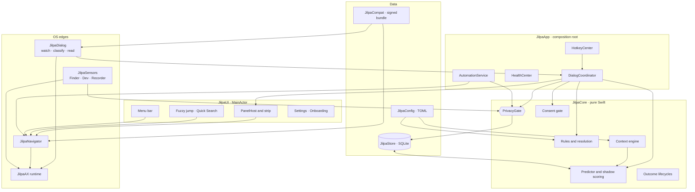
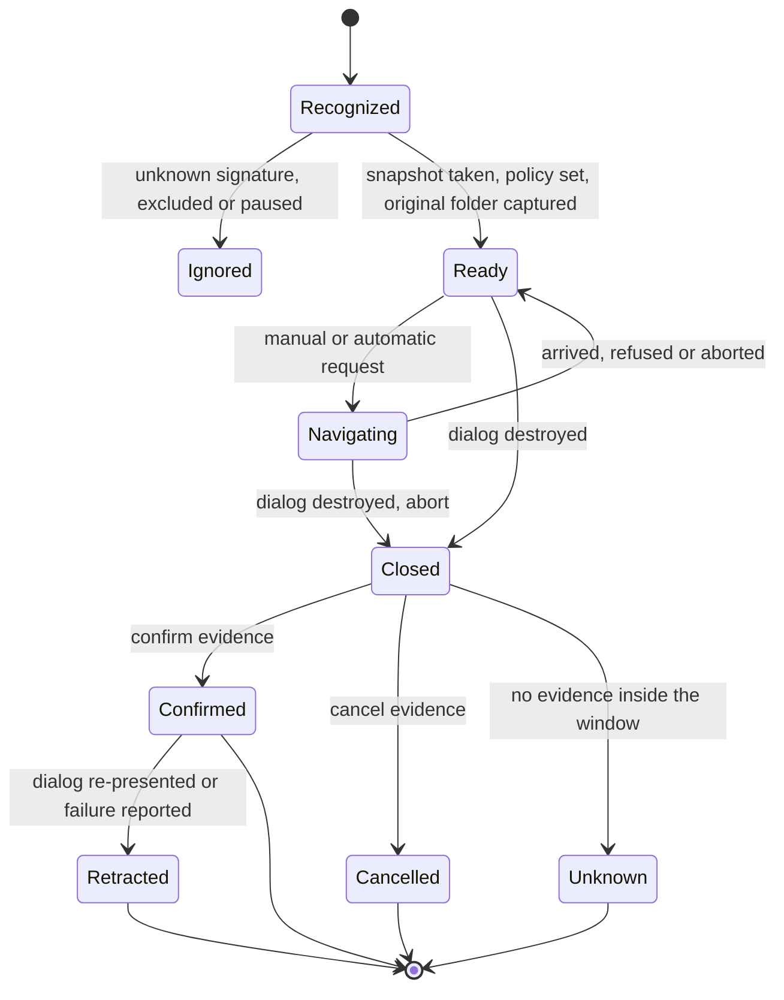
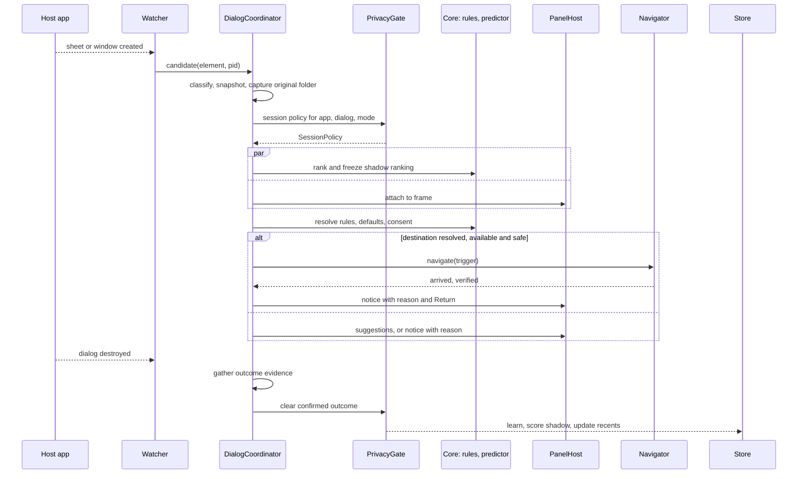

# Jilpa Architecture

2026-09-20 · Anand Hegde · companion to [PRD.md](PRD.md) and [IMPLEMENTATION_PLAN.md](IMPLEMENTATION_PLAN.md)

> The PRD owns policy: contracts, priorities, acceptance. This document owns structure: processes, modules, data, control flow and the mechanisms that make each contract hold by construction. Where the two disagree, the PRD wins and this file is wrong. Statements marked **(H, spike n)** are hypotheses about macOS behavior that the named spike must confirm before anything is built on them.

Jilpa is one non-sandboxed menu bar agent. A pure-Swift core decides; thin edge modules touch Accessibility, Apple Events, the filesystem and the screen. Every folder change goes through one Navigator, every sensed or stored fact through one privacy gate, and every dialog through one coordinator that owns its state.

## Design principles

- **One door per concern.** One Navigator for all folder changes, one privacy gate for all sensing, storage and automation reads, one DialogCoordinator that is the single writer of session state. A contract that is enforced in one place can be tested in one place.
- **Pure core, thin edges.** Rules, prediction, consent, contexts, privacy decisions and lifecycles are pure functions over value types. Edge modules translate OS events into those values and nothing more.
- **Element-targeted over synthetic.** An AX action on a specific element cannot land in the wrong window. Synthetic key events can. Use the first wherever one exists.
- **Evidence or unknown.** Every inferred fact (purpose, current folder, outcome, project, availability) is `known(value, source)` or `unknown(reason)`. Unknown never triggers automation and never trains.
- **Observers, not polling.** AX notifications, workspace notifications, FSEvents and one-shot timers. No loops.
- **Fail to stock.** On any doubt, stop sending input and leave the native dialog exactly as usable as it is without Jilpa.
- **Data narrows, code broadens.** Compatibility data can select among compiled behaviors and exclude apps. Only a signed app release can add behavior.

## System shape

**Process model.** One process, `Jilpa.app`, `LSUIElement`, Developer ID signed, hardened runtime, no sandbox. The only entitlement beyond the defaults is `com.apple.security.automation.apple-events`. Bundled alongside it:

| Artifact | Role |
| --- | --- |
| `jilpa` CLI | Thin client over a local socket. Holds no permissions and no logic |
| `JilpaDemo.app` | Tiny helper that presents Save and Open dialogs. It is the onboarding live demo host and the base of the test fixture, so onboarding exercises the real cross-process pipeline |

No launch daemon, no XPC service, no app extension. The Finder service (S6) is an `NSServices` entry in the main app. Login launch uses `SMAppService.mainApp`. A single process keeps TCC grants on one code identity and gives session state one owner. Isolation from misbehaving host apps comes from threads and timeouts, not processes. A Jilpa crash cannot harm a host dialog because nothing is injected into it.



## Module layout

One SwiftPM package with many targets, plus a thin Xcode app target that is only a composition root, `Info.plist`, entitlements and assets. Everything that matters builds and tests with `swift build` and `swift test`, which keeps CI simple and suits agentic coding tools.

```text
Jilpa/
├── Package.swift
├── App/                      Xcode app target: main, Info.plist, entitlements, assets
├── Sources/
│   ├── JilpaCore/            pure Swift: Model, Privacy, Rules, Predictor, Consent,
│   │                         Context, Outcome, Search
│   ├── JilpaConfig/          TOML model, merge, validation, watcher, atomic writer
│   ├── JilpaStore/           GRDB schema, migrations, queries, retention, export
│   ├── JilpaAX/              AXElement wrapper, AX runtime, observers, timeouts
│   ├── JilpaDialog/          watcher, classifier, reader, signatures
│   ├── JilpaNavigator/       strategies, steps, SafetyGuard, verification, history
│   ├── JilpaSensors/         FinderBridge, DevContext, SaveRecorder, Clipboard
│   ├── JilpaCompat/          bundle schema, signature check, apply and rollback
│   ├── JilpaIPC/             socket protocol shared by app and CLI
│   ├── JilpaUI/              PanelHost, strip, fuzzy jump, menus, Settings, onboarding
│   └── JilpaApp/             DialogCoordinator, hotkeys, health, automation, entitlements
├── Tools/
│   ├── jilpa-cli/
│   ├── spikes/               spike0-logger … spike8-destinations, throwaway
│   ├── FixtureApp/           dialog variants and fault switches; ships as JilpaDemo
│   └── soak/                 soak runner, per-app drivers, safety oracle
├── Tests/
└── docs/
```

| Target | May depend on | Must not import |
| --- | --- | --- |
| JilpaCore | Foundation | AppKit, ApplicationServices, GRDB |
| JilpaConfig | Core, TOMLKit | AppKit |
| JilpaStore | Core, GRDB | AppKit |
| JilpaAX | ApplicationServices | Core UI types |
| JilpaDialog | Core, AX, Compat | Store, UI |
| JilpaNavigator | Core, AX, Compat, Dialog | Store, UI |
| JilpaSensors | Core, AX | Store, UI |
| JilpaUI | Core, protocol-typed services | AX, Store |
| JilpaApp | everything | — |

SwiftPM enforces the target graph. A CI lint enforces the forbidden imports, since AppKit is importable from any macOS target.

**Third-party dependencies: three.** GRDB, TOMLKit and Sparkle 2. Hotkeys use an in-house wrapper of about 150 lines over `RegisterEventHotKey`, because registration must follow dialog scope and shortcuts live in TOML. An app that holds Accessibility permission should keep its supply chain short, and each addition needs a written reason. Two are in the package so far, each pinned to an exact version in `Package.swift` so an update is a reviewed change: TOMLKit 0.6.0 and GRDB 7.11.1, which links the system SQLite and brings no dependency of its own.

## Concurrency model

Swift 6 strict concurrency. AX calls are blocking cross-process IPC, so they never run on the main thread or the cooperative pool.

| Domain | Isolation | Responsibility |
| --- | --- | --- |
| UI | `@MainActor` | Panel, menus, Settings, hotkey callbacks |
| AX observer thread | One dedicated `Thread` with a `CFRunLoop` | Hosts every `AXObserver` run-loop source. Callbacks only translate to a value and yield into an `AsyncStream` |
| `AXSession(pid)` | Actor on its own `DispatchSerialQueue` executor | Every AX read, write and action for one process. A dialog needs one for the host app and one for `openAndSavePanelService`, which owns the file browser inside every open panel and every expanded save panel (spike 1). Messaging timeout 250 ms set process-wide at launch and again on the app element |
| `DialogCoordinator` | Actor | Session state machines. Single writer |
| Store | GRDB `DatabasePool` | Concurrent reads, serialized writes |
| Event tap thread | Dedicated thread and run loop, alive only while a dialog is open | O(1) hit test against a cached snapshot, then return |
| Core | `Sendable` values and pure functions | Callable from anywhere |

`AXUIElement` is wrapped as `struct AXElement: @unchecked Sendable, Hashable` using `CFEqual` and `CFHash`. One queue per host means a hung app delays only its own calls, each bounded at 250 ms. The bound comes from the process-wide timeout set on the system-wide element at launch: spike 1 measured that a timeout set on an app element does not carry to the elements that app vends (a window read against a stopped host blocked for 1.5 s, against 260 ms once the process-wide timeout was set). Some reads of a panel's descendants still answer in under a millisecond while the host is stopped, so a health probe reads the window or the app, never a descendant, and an element's pid is not evidence of which process serves it. A circuit breaker marks an app degraded for the session after three consecutive timeouts: the panel hides, automation stops, and the health view says why.

## Dialog pipeline

This is D1 plus the dialog reader. It turns raw AX notifications into a `DialogSession` that carries a descriptor, snapshots, a policy and a user-activity latch.

**Watcher.** On `NSWorkspace` launch and terminate notifications, create or destroy one `AXObserver` per regular app, subscribed to window created, sheet created, focused window changed and focused element changed. Once a dialog is recognized, add destroyed, moved and resized on that element. Apps that are paused or excluded get no observer at all, which is how exclusions apply before sensing. At Jilpa launch, sweep running apps once for dialogs already open; those sessions have no captured original folder, so they are manual-only.

Notifications alone miss dialogs an app raises while it launches (spike 1). A freshly launched app refuses the first subscribe with `cannotComplete` and accepts a retry about 0.45 s later, Preview's and Script Editor's launch-time Open panels exist before any observer can attach, and TextEdit's was announced by none of the four notifications in 4 of 4 launches. So the watcher retries the subscribe without charging the circuit breaker, sweeps the app's windows when the observer attaches, and sweeps once more when the app reports it has finished launching. It skips, without a health notice, entries whose pid is no longer alive (LaunchServices can list a dead process) and apps that answer `apiDisabled`.

The watcher is `DialogWatcher` in JilpaDialog, fed by `WorkspaceApps`, and neither polls. `WorkspaceApps` turns workspace notifications and two key-value observations per app (activation policy, finished launching) into `AppEvent`s; it subscribes first and lists the running apps second, so an app that launches in between is reported twice and never missed. It reads an app's version from its `Info.plist` only for a regular app under `/Applications`, `/System`, `/Library` or `~/Applications`: opening a file of an app that runs from Desktop, Documents, Downloads, a removable volume or a cloud folder would make the system ask the user to let Jilpa into that folder. An app anywhere else has no known version, which the compatibility bundle takes as an input. The watcher decides who is observed through one closure, which the app wires to the gate's `observeApp` decision, and `policyChanged()` takes observers away and gives them back when a pause or exclusion changes.

What the watcher emits is a stream of four events: attached, candidate, the raw notification, and detached with a reason. A candidate is a window or sheet that may be a dialog, with what found it: a notification, or a sweep and its occasion. The occasion carries what is known about the dialog's age. `launching` and `finishedLaunching` mean the app was watched since it started, so a dialog found then is new. `alreadyRunning` means the app ran unwatched, at Jilpa's launch or until a pause ended, so the dialog's age is unknown and its session is manual-only. Every observer has a number, and a sweep that outlives its observer stops: a sweep begun before a pause must not report a dialog under the old observer's occasion after it. Sweeps run beside the event loop, not before it, because the first reads of a starting app take most of a second and a dialog announced in that time must not wait for them. A sweep reports every window and every sheet, so the coordinator drops the windows it already knows; the watcher itself only collapses focus changes inside one window. A session has one event stream, so the watcher forwards every raw notification for the coordinator's element-level subscriptions. Subscribes are retried 8 times, 400 ms apart, uncharged; an app that never accepts, or whose stream ends, is taken up again when it is next activated, which is a notification and not a poll. A focus change is resolved to its window by `AXTopLevelUIElement`, then `AXWindow`; what either returns for an element inside a sheet is unmeasured **(H)**, and the three window-level notifications do not depend on it.

Checked live with `jilpa-soak classify` (2026-09-21, macOS 26.4.1, M4, debug build): the product watcher, workspace adapter and classifier against FixtureApp, 12 dialog kinds, presented by command after attach and at launch, 48 dialogs. All 48 were recognized as the right variant, no other fixture window got past stage one (48 rejected), every panel named the open-and-save service as its one foreign process and key target, and every observer detached when its app quit. Dialogs raised after attach were first announced by `AXFocusedWindowChanged` (16) or `AXSheetCreated` (8), and recognized 210 ms after presentation at the median for windows and 440 ms for sheets, 495 ms at worst. Dialogs raised at launch were all found by the attach sweep, about 420 ms after presentation; every launch needed exactly two subscribe attempts, so the 400 ms retry interval is most of that time. The structural stage took 76 ms at the median and 178 ms at worst. The fixture is the only host measured this way; the tool observes no other process.

One observer per regular app passed the idle budget in spike 1 with room to spare: 0.03% of a core and 7.7 MB with 20 apps observed, 0.25% while a dialog was raised every 1.3 s. The frontmost-only fallback is not needed.

**Classifier.** Two stages. The first runs inside the 150 ms attach budget for windows; for sheets it cannot, see Attach budget.

1. Fast reject. One batched `AXUIElementCopyMultipleAttributeValues` for role and identifier, and nothing else: a window's title is the user's document name, and the classifier has no use for it (`StageOne.attributes`). Nearly all windows exit here in well under a millisecond. The discriminator is the window's AX identifier, `open-panel` or `save-panel`. Spike 1 confirmed it on macOS 26.4.1 for non-sandboxed AppKit hosts and for sandboxed hosts, as app-modal window, modeless window and sheet: 98 dialogs matched, 0 of 55 other windows in 21 apps, Open and Save never confused. Role, subrole and `AXModal` are not part of the signature; an app-modal panel can report `AXStandardWindow` and modal false. Office, Adobe, Electron, Catalyst and Java hosts are still unmeasured **(H, spike 1 operator pass)**. The first read of a new sheet takes about 300 ms, longer than the messaging timeout, so this read is retried up to three times and those retries do not count toward the circuit breaker.
2. Structural signature. Locate anchors by AX identifier: `OKButton`, `CancelButton`, `saveAsNameTextField`, `where popup`, and the file browser (`ColumnView`, the list outline or `IconView`, depending on view mode, inside the service-owned subtree). The window's default-button and cancel-button attributes are nil on every panel measured, so they are not used. A dialog is announced before it has content: the confirm button appears about 0.5 s after presentation for windows, 0.75 s for sheets and up to 1.3 s in Apple's apps. The structural stage therefore polls a pruned snapshot, file listings cut off, about 3 ms a poll, until the anchors exist or 1.5 s pass; the panel may attach after stage one, but nothing that needs an anchor runs before this stage ends. The content arrives in pieces, over 70 to 84 ms from the first poll that finds anything, and a save panel read in that time can match without its browser and look collapsed. So one match is not an answer: two polls in a row have to agree, or the deadline has to pass (`StructuralStage`, 50 ms between polls). Signatures are declarative data with built-in defaults and per-app overrides from the compatibility bundle.

```swift
struct DialogDescriptor: Sendable, Hashable {
  var variant: DialogVariant          // open or save panel, as window or sheet
  var purpose: Resolved<DialogPurpose>  // from the panel's identifier: open or save. Export and
                                      // chooseFolder are never concluded from structure
  var keyTarget: pid_t?               // the host's own open-and-save service process, read from
                                      // the panel's elements and checked by executable. Nil means
                                      // no key can be delivered, so no Go to Folder
  var capabilities: Set<Capability>   // filenameField, goToFolder, readFolder, readSelection
  var anchors: DialogAnchors
  var signature: SignatureName
  var support: SupportLevel           // supported, provisional, degraded. Unsupported, excluded
                                      // and unlisted make no descriptor at all
  var strategy: StrategyName?
  var timing: StrategyTiming
}
```

The matching half is pure and lives in `JilpaDialog` (`StageOne`, `PanelSignature`, `DialogDescriptor`): it takes a pruned snapshot and the compatibility answer, and the live half only feeds it. Its rules, each on the fail-to-stock side:

- A required anchor that occurs twice is `ambiguous`, and an ambiguous dialog gets nothing. An accessory view may carry a button with an anchor's identifier, and which of the two the host's confirm button is cannot be guessed.
- A snapshot that is not whole proves nothing: when a node could not be read, or the node budget cut children that are not a file listing, the answer is `partial`, never a match. An accessory view comes before the panel's own buttons in the tree, so the missing part is where the real ones would be.
- Sheets below the panel and the Go to Folder sheet (`GoToWindow`) are other surfaces. Their buttons are never the panel's anchors.
- Nothing under a file listing is looked at, whether or not the snapshot was pruned.
- A key target counts only when it is one of the processes that serve the panel's own elements. A collapsed save sheet has none (spike 1), so it is recognized and never navigated.
- A descriptor exists only for a compatibility cell that names this variant and this signature. Data selects and excludes; it cannot make a dialog that failed the compiled signature match.
- A dialog can be navigated when a key can be delivered, the folder can be read back, and, in a save panel, the name field exists to be checked before and after.

Whether the host is sandboxed (`hosting`) is not part of the pure half: it comes from the host's entitlement, never from element pids, because spike 2 found service-owned elements in a non-sandboxed host too. It is added with the live half if a strategy turns out to need it.

A matched provisional cell gets a labelled panel with manual navigation only. An unmatched window gets nothing. Save versus Export and file versus folder chooser often hinge on localized button titles, so structure never concludes them: a save panel's purpose is `save` and an open panel's is `open`, with the panel identifier as the source, until per-app signature data says otherwise. An Export dialog therefore follows the Save defaults. Whether that is what the PRD means by a purpose-specific default is an open owner decision (spike 1, owed PRD edit); the alternative, `unknown` for every save panel, would switch purpose-specific defaults off everywhere. Spike 1 found nothing cheaper: an Export or folder panel is the same panel with the same identifier and anchors, and all five Export dialogs in Apple's apps keep "Save" as the confirm title.

**Reader.** Produces a `DialogSnapshot`: current folder, proposed filename and selection range, selected items, focused element, view mode. Sources for the current folder, as Spike 3a measured them on macOS 26.4 (the view is known from the browser's identifier: `ColumnView`, `ListView`, `IconView`):

1. **Column view: the selection chain.** The last column list with a selected child; that item's `AXURL` if it is a folder, else its parent. Right in every reading, and the only source that names an empty folder.
2. **List and icon view: the first browser item that carries an `AXURL`, taking the parent.** In list view row 0 is a header group, so it is the first row *with* a URL, not row 0. Icon view items belong to the open-and-save service's pid and need a second `AXSession`; everything else in the panel reads through the host's. In column view this source is a fallback only when no column has a selection: when the current folder is empty it names the parent, silently. In an empty folder in list or icon view no source exists and the folder is `unknown`.
3. **The path pop-up's value** (`where popup`). A display name, flagged `displayNameOnly`, never used for arrival verification, and wrong for a folder reached through a symlink. Its `AXValueChanged` is the folder-change signal in every view and in the collapsed panel; one change fires it 18 to 30 times, so the reader debounces.
4. **The path pop-up's ancestor chain** exists only while its menu is open. Opening it is visible and takes about 400 ms, so the reader never does it by itself.

The dialog window and the path control carry no document or URL attribute; that candidate is dropped. **A collapsed save panel has no real-URL source.** Its folder is `unknown`, so arrival cannot be verified, automatic navigation is off in that state, and the panel says why. A whole read costs 5 to 12 ms at p50 and at most 44 ms in ordinary folders; in a folder of 1,500 items it reached 97 ms in list view and 73 ms in column view, so reads are debounced and a large folder is part of the navigation budget in Spike 2.

Folder equality is by volume and file resource identifier after resolving symlinks, never by string, because of `/private`, firmlinks and case. As built, that is `FolderIdentity.same`, which looks at the two items' metadata and lists nothing and opens nothing. It answers nil when either cannot be looked at, and `provablySame` turns nil into "not the same", so a folder that has gone is a folder something happened to and the latch trips. Both URLs must be live: the two identifiers did not survive a remount in spike 8, so what is *stored* about a folder is a `LocationIdentity` instead.

As built (`DialogReader` in `JilpaDialog`): one stateless `read(window, as: signature)` that returns `snapshot`, `unmatched` (the window does not read as its panel just now) or `gone`. Each reading takes a fresh `PanelTree` and matches the signature again, because the browser is another element after a change of view and absent in a collapsed panel. Only the host's open circuit breaker throws; any other part that fails to read is nil or `unknown(reason)`, and a failed read anywhere in the columns makes folder and selection `unknown`, since the missing part may hold the deeper selection. The rules on top of the sources above:

- **Column view is stricter than the spike's reader.** With several columns and a selection in none, the folder is `unknown(dialog.no-column-selection)`; the first-item fallback is used only when there is exactly one column. The ordinary state always has a selection, because the current folder is selected in its parent's column.
- **One selected item** is looked at on disk (`isDirectory`, `isPackage`; no open, no listing): a folder is the current folder, a file names its parent, a package is `unknown` because nothing in the panel says whether its host shows packages as folders **(H, unmeasured)**, and an item that cannot be looked at is `unknown`. Several selected items name their parent without a look.
- **Selection** counts every selected item and reads the URLs of at most 16. In icon view the items are groups under a section list under the collection list (`IconView`), and the selection is read from the nearest element above the first item that has one, which is the collection list.
- **Focus** is the app's focused element, its role and identifier, as `name-field`, `listing` or `other`. It compares by those, not by element, since the listing is rebuilt on every folder change. The focused element must be asked for in a call of its own: in a batched read (`AXUIElementCopyMultipleAttributeValues`) its slot holds an error (code -25238) every time, while the single read answers.
- A list view reads `AXRows` whole, which is what makes a 1,500-item folder slow there; `AXVisibleRows` is the unmeasured alternative.

Measured with `jilpa-soak read` against FixtureApp on macOS 26.4.1 (56 dialogs: four variants, column, list and icon view plus the collapsed save panel, a normal, an empty, a symlinked and a 1,500-item folder, five readings each, the fixture's own state as the truth): every known folder was the fixture's by file identity (47 of 47), every reading of an empty folder in list or icon view and of a collapsed panel was `unknown`, the name, the selection after one item was selected, the view and the focus were right in every reading, and repeated readings agreed. 63 of 64 readings met the criteria written before the run. The one that did not was `unknown(dialog.no-column-selection)` just after the tool had switched the panel into column view: for up to about half a second the columns have their items and no selection yet. It happened in 2 of 11 such switches and read right 526 ms later in the one that was followed up; it was never a wrong folder. **The coordinator therefore reads again after an `unknown` that follows a change of view or folder**, and does not treat one reading as final. A reading takes 2 to 5 ms at p50 and at most 13 ms in every view, except list view in the 1,500-item folder at 41 to 44 ms. No real app has been read yet **(H, operator pass)**.

**AX return codes are not evidence** (Spike 3a). `AXOpen` on a browser item returns `attributeUnsupported` and navigates every time; setting `AXSelectedChildren` to select a file reports failure and selects it. The Navigator verifies every step by reading the result back and ignores the returned error except for timeouts and an invalid element.

**Session state.**



**User-activity latch.** A per-session flag, not a state. It sets on any event not attributable to Jilpa's in-flight step: an unexpected focus change, a filename value change, a selection change, a folder change Jilpa did not request, or a mouse-down inside the dialog frame while the tap is active. Once set, automatic navigation is off for the rest of that dialog. Manual Jilpa actions still work. Each navigation step declares the events it expects, and everything else trips the latch.

As built (`DialogSession` in `JilpaDialog`), the state above and the latch are one pure value type with no clock, no AX and no I/O: every change is `handle(event)`, and the events are a snapshot, a failed reading, an activity, a navigation beginning or ending, destroyed, an outcome and a retraction. `handle` returns a `Rejection` for anything out of order — navigating a closed dialog, expecting a kind that no navigation can expect — so the coordinator can refuse without a state of its own. The latch is set once and never cleared; `automationBar` turns the whole of it into the one line the panel shows, in order: the latch, then not ready (not ready yet, no reading, or the last reading failed), then this dialog cannot be navigated, then a provisional or degraded support level, then a folder that is unknown and why.

Which kinds of activity a reading shows is `SnapshotChanges`, and it errs toward activity: a folder that was known and is now known somewhere else, or known and now unreadable, is activity, but a folder that was unknown and became known is not, since that is the listing settling and not the user. A change of the path pop-up's display name counts as a folder change even when both readings name the same URL, because a symlinked folder and its target share a URL and not a name. Filename, filename selection, selection, focus and view count only when both readings read that part, so a failed read never invents activity. Selection has one exception, measured rather than reasoned: a selection that appears in the reading that first makes the folder readable is the listing choosing its own first row, so it counts as nothing, while a selection that was already there and changes counts even in that reading. A dialog found by a sweep of an app that ran unwatched starts latched with `found-already-open` and with no original folder, which is the manual-only session the watcher section describes. The original folder is the first folder that was known, and it is captured from the reading rather than at recognition, because at recognition the listing may not have settled.

**Coordinator.** `DialogCoordinator` in `JilpaApp` is an actor and the only writer of session state. It consumes the watcher's stream and emits its own: found, ignored, gone, updated, closed, ended. Everything else — the panel host, the Navigator, the outcome recorder — reads that stream and writes back through `beginNavigation`, `endNavigation` and `note`, which are the only doors into a session.

It keeps one entry per window element, and only while that dialog is open. Nothing is remembered about a window that turned out not to be a panel, because an element is a slot the system reuses: the same `AXUIElement` can be another window an hour later, and a cached "not a panel" would make Jilpa blind to it. A window reported again while it is being classified is dropped; one reported again while it is open is read again, not classified again; one that was ignored is re-classified only when a notification says the window was just made, never on a sweep or a focus change. The gate is asked for the session policy after stage one and before anything is said or read, so an app that is paused or excluded costs one batched read of role and identifier and is ignored with `denied`. The destroyed notification is subscribed before the first reading, so a dialog that closes during it is not missed.

Readings are coalesced. A change notification schedules a reading after a settle time rather than taking one; a burst of 18 to 30 `AXValueChanged` events for one folder change therefore costs one reading. Anything announced while a reading is running marks the entry dirty and buys exactly one more reading after it. An `unknown` folder that may be the listing settling (no column selection, no item with a URL, an unreadable browser, no browser) is read again a few times and then left alone; a collapsed panel and a selected package are not, since they stay as they are until something changes and that is announced. A reading that does not match the signature, or that the host does not answer, leaves the session stale: the panel says not ready and manual navigation is off until one succeeds. Only the unmatched case is read again by itself; a host whose breaker is open is not poked.

The element-level subscriptions follow each reading, since the browser is another element after a change of view and absent in a collapsed panel: destroyed on the window, value changed on the path pop-up and on the name field, selected children and selected rows on the browser. `jilpa-soak coordinate` measured them live on 25 dialogs of the fixture, all in column view: every subscription was accepted, and every anchor belongs to the host process rather than to the open-and-save service that draws the panel, so one observer on the host covers the whole dialog. What posts is narrower than what is asked for. The path pop-up's value is the workhorse, about nine events for one Go to Folder move; the browser's selected children announce the listing's first rows, roughly once a dialog; selected rows never arrived, because the panels were in column view throughout. That row, and what the name field posts while the user types, stay **unmeasured (H)**. Neither is load-bearing: a notification an element does not post is simply left out, and the path pop-up and the focus still say that something changed.

The settle and re-read intervals stand at 150 ms, then 300 ms three times, now from that run rather than from a guess. One move raises 19 to 23 notifications and costs 3 to 6 readings, which is the coalescing they exist for, and the session saw every move. The re-reads run out about 1.05 s after the first notification, and the slowest listing seen took 1.1 s to show its first row, so there is no margin in that number; what recovers such a panel is the browser's selected-children notification, which arrives with the rows. Timings, all p50: the watcher finds a dialog 381 ms after it is presented (max 411 ms) and the first reading makes it ready at 463 ms (max 537 ms, and 1.1 s on the slowest listing).

A dialog ends in two steps. Closed is emitted at once, from the destroyed notification or from a reading that finds the window gone, and the entry is removed then, so the element is free for the next dialog and that one gets a new session. Gathering the outcome evidence then runs on its own, and ended follows with the result. When the observer went first — the app quit, or a pause or exclusion took its observer away — the outcome is `unknown(outcome.observer-ended)` and no evidence is asked for, because a dialog closing is not a confirmation and an observer that stopped watching saw no close at all. The open-and-save service's `AXSession` is discarded with the dialog it served; the host's own stays with the watcher.

`jilpa-soak coordinate` runs the whole chain live against FixtureApp — watcher, classifier, reader, coordinator — and is what the numbers above come from. It presents a dialog, changes its folder with the same Go to Folder driver as `jilpa-soak run` — Command+Shift+G and Shift+Return posted to the fixture's own open-and-save service, the path set by AX, never to the global event stream and never the confirm button — and ends the dialog by the fixture's own Cancel or by quitting the fixture. The first move of each dialog is announced through `beginNavigation` and `endNavigation` the way the Navigator will announce its own; the rest are not. It checks that each dialog is found once as the right variant, that its first reading is ready with the folder it was given by file identity, that an announced move trips no latch while an unannounced one trips exactly one, that the original folder is held across every move, that one move costs at most six readings, and that closed precedes ended with an unknown outcome. Three rounds of the eight variants, 25 dialogs and 72 moves, passed all of it: 24 announced moves latched nothing, 48 unannounced ones latched `focus`, and the original folder survived every move — contract 1 measured in both directions. A move is seen by the session 844 ms after the first key goes out (max 920 ms), most of which is the navigation itself.

Two of the criteria were written before the driver was known and are narrower in the tool's first version: the latch was to trip as `folder`, and a move was to cost at most two readings. Both assumed a bare folder change. A Go to Folder navigation is four changes — its sheet appears, focus moves into it, the folder changes, focus comes back — so it latches whichever the session sees first, which is `focus`, and it costs a reading for each. The driver changed for a reason worth recording: the first version had the host move its own folder by the fixture's `directory` command, and on macOS 26 assigning `directoryURL` to an `NSSavePanel` that is already on screen is taken by the property and ignored by the panel, so the folder never changed and there was nothing to announce. That driver stays available as `--move host` because it is the evidence for that sentence.

The run also found a defect in `DialogSession` and is why `SnapshotChanges` treats one selection change as nothing. A panel whose first row took 1.1 s to appear read first as no folder and no selection, then as one row selected — the panel choosing its own first row, not the user. Taken as activity it latched the dialog before it had finished coming up, which by contract 1 ends automation there for good, and because the original folder only settles while nothing has been latched, it also left that dialog with no folder to return to. A selection that appears in the same reading that first makes the folder readable is therefore the listing settling; every other selection change stands.

**Outcome detection.** Jilpa has no keyboard tap by contract, so it cannot see Return or Escape. Confirmation is therefore inferred from evidence, and the result is three-valued:

| Evidence | Source | Yields | Covers |
| --- | --- | --- | --- |
| Click released inside the confirm or cancel button frame just before close | Mouse tap, already scoped to dialog lifetime | Confirmed or cancelled | Mouse users |
| Double-click on a browser row just before close, Open dialogs | Mouse tap | Confirmed | Mouse users |
| Follow-up sheet from the same dialog, such as Replace | AX, the sheet's own `AXParent` chain | Pending only. It never confirms by itself: keep-then-cancel looks the same (Spike 3a, 9 of 9; live 8 of 8) | Everyone |
| Host shows a window whose document URL is the selection or lies in the last-read folder | AX | Confirmed | Document apps |
| A file with the proposed name (the name field hides the extension, so the stem is matched) is created in the last-read folder inside the window, or modified there after a Replace sheet was seen | FSEvents on that one folder, plus `lstat` on the exact name | Confirmed | Save and Export |
| None of these | — | Unknown | Every cancel, keyboard confirm in non-document flows such as a browser upload, folder choosers, and any dialog whose folder was `unknown` when it closed (collapsed save panel, empty folder in list or icon view) |

Spike 3a measured the three AX and filesystem rows on the fixture: 100 of 102 keyboard-style save and export confirms detected, 6 of 6 opens with a document window, no wrong outcome, and nothing in the notifications around the close that separates confirm from cancel. The two mouse rows are **unmeasured (H, spike 3a operator pass)**: `CGEvent.tapCreateForPid` does not yield a tap on another process, so the tap would be a listen-only session tap for mouse-up only, filtered by the dialog's frame and lifetime, and it ships only if it works with the Accessibility grant alone. If it needs Input Monitoring, contract 2 forbids it and both rows are removed.

The evidence window opens at the dialog's destroyed notification, which trailed the user's action by up to 1.3 s when a Replace sheet sat in between, and closes 3 s later; the file appeared within 200 ms of the close in every trial. Whether the file was created or modified is read from that `lstat` (birth or modification time at or after recognition, or a difference from the snapshot) and never from the event's flags, which carry `created` and `modified` for a mere attribute change on a file up to several seconds old (spike 6). What decides created from modified is whether the proposed name was occupied when the watch last looked, never whether the item under it is still the same one: a safe save writes a temporary file and renames it over the old one, so an overwrite keeps the name and loses its identity. The watcher never lists the folder and never opens a file, only file-level FSEvents and `lstat` on the one name, and Spike 3a's folder probe showed that this needs no consent and raises no prompt in `~/Documents` and `~/Downloads`. One known limit stays: a file of the proposed name *created* in that folder by another process while the dialog is cancelled reads as confirmed, since nothing outside the host can tell the two apart.

`jilpa-soak outcome` runs the whole chain with the save recorder and the document-window watcher behind it and checks the verdict of each dialog against what the fixture did. It sends nothing at all: every dialog is confirmed, replaced, kept or cancelled by the fixture pressing its own buttons, and the only thing the tool changes in a dialog is the selection of one listed item, set by AX. Nine case rows over the eight variants, 31 dialogs, passed all of them: created 4 of 4, replaced 4 of 4, kept 4 of 4 as `unknown(replace-sheet-only)`, a document window 7 of 7 (4 saves, 3 opens), every cancel and the folder chooser 8 of 8 as `unknown(no-evidence)`, and private mode 4 of 4 refused. The Replace sheet was seen in 8 of 8 and is owned by the host, not by the open-and-save service: `AXSheetCreated` arrives on the host's own application element, and the sheet's `AXParent` **is** the dialog in all 8 — `AXSheet` under a sheet-presented dialog, `AXWindow` under a window one — so the three-step parent walk that attributes a follow-up to its dialog never needed a second step. `AXDocument` answered 7 of 7, with the name that was saved or the item that was selected. A verdict costs the full 3 s window whenever the file lands after the close is seen (3.0–3.3 s), and 11–13 ms when the host wrote before it, which is the modal variants: nothing waits on a timer that the evidence has already settled.

That run also found a defect. The recorder called an overwrite a *creation* whenever the file under the name was a new item, which is what a safe save always leaves, and a creation confirms on its own without the Replace sheet having to answer for it — so an autosave rewriting the document behind a cancelled Save As would have read as confirmed, the exact case the modified-plus-Replace pair exists to catch. The occupied name decides it now, and the replaced row went from wrong to 4 of 4.

`Unknown` trains nothing and is left out of hit-rate denominators. Its share is reported per app, because a high share biases every learning metric toward mouse users. The filesystem row is a small, single-folder watcher, not the full save recorder, so P0 learning still does not depend on N6. This mechanism is the largest underweighted risk in the PRD and is listed again under Gaps.

**End-to-end sequence for a Save dialog.**



## Navigator

The Navigator is D3 and D20, and it is where the navigation safety contract lives. Nothing else in the codebase may change a dialog's folder.

```swift
public protocol Navigating: Sendable {
  func navigate(_ request: NavigationRequest) async -> NavigationResult
}
struct NavigationRequest { var session: SessionID; var target: Location; var trigger: Trigger }
enum Trigger { case manual(ManualSource), rule(RuleID), explicitDefault, prediction, history(HistoryMove) }
enum NavigationResult {
  case arrived(VerifiedArrival)
  case refused(RefusalReason)                       // nothing was sent
  case aborted(AbortReason, RecoveryState)          // user or guard stopped it
  case failed(FailureReason, RecoveryState)
}
```

**Pipeline.** Resolve the target under the no-substitution policy (missing, unmounted or online-only means `refused` with a reason, never an alternative). Select the strategy for the compatibility cell. Run its steps under the SafetyGuard. Verify arrival. Record the attempt through the privacy gate. Push a history entry.

**Input hierarchy, in strict order of preference:**

1. Set an AX attribute or perform an AX action on a specific element. It cannot reach another window.
2. Post a key chord with `CGEvent.postToPid` to the process that draws this dialog. It cannot reach another app. On macOS 26 that process is the host's own instance of the system's open-and-save service, not the host: spike 2 found that Command+Shift+G posted to the host pid opens nothing, in a host that is not even sandboxed. The service pid is taken from an element of this panel (the splitter inside the browser's split group is service-owned in every expanded panel measured) and accepted only when that process's executable is `com.apple.appkit.xpc.openAndSavePanelService`. Every host has its own service process, so the key still cannot reach another app's dialog.
3. Never: posting to the global HID stream, synthesizing mouse input, typing a path as keystrokes.

**The confirm-key rule** (was "the Return rule"). The one step that could violate "never presses the final confirmation" is confirming the Go to Folder UI, because a Return that arrives after that UI has vanished hits Save. Spike 2 settled three things on macOS 26.4.1. First, nothing on the sheet confirms it: `AXConfirm` on the field, `AXOpen` on the suggestion and `AXPress` on its close button all return success and do nothing, so a key is the only way. Second, **a guarded plain Return is forbidden**: with the focused element verified immediately before posting, it still confirmed the fixture's Save dialog in 3 of 240 raced attempts, because the guard and the key travel separately and no check in Jilpa's process can close that window. Third, **Shift+Return confirms Go to Folder and is ignored by a panel that has no sheet**, in every variant and with an item selected in the listing: 0 violations in 330 raced attempts, 132 of which sent the key into the race. So the confirm key is Shift+Return, still behind the guard, and the safety argument rests on the key being harmless when it is late, not on the guard being fast. That is a property of an AppKit build, not of Jilpa: the key-hazard probe (`jilpa-soak keys`) has to pass on a macOS version before the Go to Folder variant for that version is enabled, and it reruns on every OS update in the release checklist. Whether a harmless-when-late key satisfies contract 1 as written is an open PRD decision, see Gaps.

**SafetyGuard, run before every step:** the dialog element is valid and is the same identity; the owning process is frontmost and the dialog, or UI that Jilpa opened on it, is its focused window; the focused element is the expected one; the user-activity latch is clear; the time budget is not spent. Any failure aborts with no further input.

**Primary strategy: Go to Folder.**

| # | Step | Action | Verifies |
| --- | --- | --- | --- |
| 1 | Snapshot | Read filename, selection range, focused element, current folder | Reader capabilities present |
| 2 | Trigger | Command+Shift+G posted to the dialog's `keyTarget` | Dialog is the host's focused window |
| 3 | Await UI | Wait for the sheet `GoToWindow` holding the field `PathTextField`, by identifier, through AX notifications | The sheet's parent is this dialog |
| 4 | Set path | Set the field's `AXValue`, read it back, wait for the sheet's suggestion row | The row names the target by file identity; the value still equals the target path |
| 5 | Confirm sheet | Shift+Return posted to the `keyTarget`. Nothing is sent after this step, whatever happens | The confirm-key rule |
| 6 | Await arrival | Wait for the sheet to leave, then for the folder-changed signal | Go to Folder UI is gone |
| 7 | Verify | Re-read folder, filename, extension, selection and focus | Folder identity equals target; filename and extension unchanged; focus is on the same element, or for a file listing, which is rebuilt on arrival, the same kind of listing |

Spike 2 measured this strategy on FixtureApp on macOS 26.4.1. Setting `AXValue` does update the field's model: the sheet's second table row carries a list whose identifier is the resolved path of the field's value, and it names the target about 110 ms after the set. That row is the gate in step 4 because it is evidence from the sheet, not an echo of what was written. Over 4,430 plain navigations in nine variants, three views and four kinds of target there was no violation; 4,348 arrived verified, 80 were the unverifiable empty targets and 2 were safe aborts when another app took the active state. Counts per cell are in `docs/COMPATIBILITY.md`. A navigation takes about 800 ms at p50, about 330 ms of it from the chord until the path field exists and about 355 ms from the confirm key until the sheet is gone; the folder reads as the target in the same pass that finds the sheet gone, never earlier, so there is no quicker arrival signal. The save panel returns a proposed name in decomposed Unicode form whatever form the host proposed, so the filename check compares by canonical equivalence (Swift `String` equality), never bytes. The path field opens prefilled with the last path the user gave Go to Folder in any app. The strategy reads it only to confirm its own write, never logs or stores it, and its diagnostics redact it; a side effect the user can see is that Jilpa's target becomes that remembered path. Refusals before any input: the panel has no confirm button yet, the target is not an existing folder after following symlinks, the folder already equals the target (reported as arrived), or the dialog has no `keyTarget`. **A collapsed save panel has no service-owned element**, so it has no `keyTarget` and is a refusal state, which agrees with the reader having no folder source there. An empty target in list or icon view ends `failed` as unverifiable, since the reader cannot name it. Still open: a sandboxed host, whose whole panel is remote, and any real app **(H, spike 2 operator pass)**; macOS 27 **(H, spike 2 on 27)**. Per-OS differences live in compiled variants such as `GoToFolder.v26` and `GoToFolder.v27`; v26 is the strategy above. Compatibility data chooses a variant and timing values inside compiled bounds.

**Recovery matrix.**

| Failure point | Dialog state | Action |
| --- | --- | --- |
| Before trigger | Untouched | `refused`, notice line |
| Go to Folder UI open, identity verified | Jilpa-owned UI showing | Leave it open and say so in the notice. No element closes the sheet (spike 2), and Escape or Command+Period sent late cancels the whole dialog, which is the confirm race with a different victim. Never a closing key |
| After confirm, arrival unverified | Unknown | No input. Re-read once. Notice that arrival could not be verified |
| User interrupted at any point | The user owns it | Stop. Never resume in this dialog. Leave any open UI alone |

A notice never claims the dialog is untouched once any step has run.

**History (D20).** A per-session stack of verified arrivals starting with the original folder. Native navigations by the user are pushed too when the reader observes them, so Back behaves like a browser. Back, Forward and Return are ordinary requests through the same pipeline. The stack dies with the session. The model is `NavigationHistory` in `JilpaCore`, and it only names targets: it moves when the Navigator reports a verified arrival, never when a move is asked for, so a refused, aborted or failed move leaves it where it was. Back and Forward step along the entries and lose none. Return goes to the first entry, so Forward retraces the way, and it is unavailable when the dialog's first folder could not be read or the dialog is in that folder already. Any other arrival drops the entries ahead and adds one. Entries are compared by place, so the same folder read again, or renamed while the dialog is open, adds nothing. Spike 3b ran ten-move sequences through the spike 2 strategy: 1,809 of 1,809 history moves ended in the right folder with the typed name byte for byte and its selection kept wherever there was one. A click by the user in the listing takes the selection out of the name field and AX cannot put it back while the row has focus, so no restore is attempted then. The spike's tool modelled Return as a visit, not as the rewind described here; the navigation measured is the same and the choice is open (Gap 22). The panel's own Command+[ and Command+] are not used: they follow a history that includes folders Jilpa never verified.

**Filename-field fallback** is compiled but gated by a build-time qualification flag that compatibility data cannot set.

**Rejected approaches:** writing other apps' `NSNavLastRootDirectory` defaults (must pre-empt the dialog, edits other apps' preferences, breaks on containers), synthesized drag and drop, and any form of code injection.

## Panel host and input

**Window.** One `NSPanel` subclass, created at launch and reused. Style `[.nonactivatingPanel, .borderless]`, `becomesKeyOnlyIfNeeded`, `hidesOnDeactivate = false`, `canBecomeKey` true only while fuzzy jump is open. Collection behavior `[.fullScreenAuxiliary, .ignoresCycle, .transient]`. A modal file panel has a window at the modal panel level (8), and a strip at that same level falls behind the dialog as soon as the dialog is clicked. The strip sits at `modalPanel + 1`, the lowest level that stayed in front of sheets, modeless and modal panels in spike 3b; floating is enough for the first two, and one level for all is the simpler rule (Gap 22). `isFloatingPanel` sets the level to floating, so the level is set after it and after anything else that implies one. A window that high would float over other apps, so the panel shows only while the host app is frontmost and the dialog is on the active Space, and hides on deactivation.

**Attach budget, 150 ms at p95:** classify 40 ms, frame read 10 ms, policy and layout 10 ms, ranking 50 ms in parallel, order front one frame. The panel shows when ranking is ready or at 120 ms, whichever is first; late chips fade in without reflow. Measured in spike 1 from the notification: a window classifies in under 1 ms (p95 0.38 ms, n=61), a sheet in about 300 ms (p95 313 ms, n=37). The cause is not established; in Apple's apps only the first sheet of a process was slow and later ones took under 1 ms, while in the fixture every sheet was slow. Sheets therefore cannot be promised 150 ms; a separate sheet figure is an open PRD decision, see Gaps.

**Geometry.** AX frames are global with a top-left origin; convert using the primary screen height and place on the screen that holds most of the dialog. Dock side follows the user's preference and falls back in a fixed order when it would leave the screen. For sheets, dock to the sheet's lower edge inside the parent window. The rule is `PanelDocking` in `JilpaCore`, pure and in points, so displays of different scale need nothing from it. The fixed order is the preferred side, the one across from it, then below, above, right, left. A side has room when the strip, outside the dialog's frame and along the part of that edge that is on the screen, lies within the screen's visible frame and is at least the strip's shortest useful length. The strip never covers the dialog: its lower edge holds the host's confirm button and its upper edge the name field. When no side has room, a dialog that fills the screen for one, there is no strip, the menu bar and the hotkeys remain, and the health view says why. A sheet tries the room under it first, whatever the preferred side, because its parent is blocked while it is open; when that room is off the screen it falls back like a window.

**Tracking.** Moved and resized notifications are coalesced to one frame update per display refresh; the host merges nothing itself and sends one notification per change (spike 3b: 14,400 steps, 14,400 notifications, at 60 and at 120 steps a second). For a sheet the subscription is on the window the sheet hangs from, because a sheet never reports a move of its own (0 of 3,600). Cross-process child windows are not possible, so the strip follows by reading the dialog's frame and setting its own. Spike 3b found no lag on that path: from the host's frame change to ours took 4 ms at p95 and 10.4 ms at worst. That is a lower bound taken from programmatic moves, not what the eye sees in a hand drag, which is an operator row. So the strip follows live, and fade-on-move (the strip fades out while the dialog moves and returns on settle, instantly under Reduce Motion) is built as the fallback that row can switch on.

**Strip UI.** AppKit views in a stack for predictable behavior in a non-activating panel; SwiftUI is used for Settings, Quick Search and onboarding. `NSGlassEffectView` for Liquid Glass, an opaque window background under Reduce Transparency, a visible border under Increase Contrast. Zones collapse by available width as the wireframe describes. The notice line is a small state machine showing one message at a time, with priority recovery, then unavailable destination, then automatic-navigation reason. It posts a VoiceOver announcement.

**Suggestion chips (N1).** The suggestions zone draws up to three chips, each with its pick number: the folder resolution named for the dialog first — a rule or a default the gate would not let navigate, one that cannot be reached, or the one it went to — and then the dialog's ranked set, less the folder the dialog is in and less anything already a chip, compared by `isSamePlace`. `SuggestionChips` in `JilpaCore` chooses them and is tested alone; the strip draws what it is handed. A cold start has fewer chips or none, and then the zone asks for no room: there is no fallback folder any more, because a folder nobody has a reason to offer is the fabricated suggestion N1's acceptance forbids. A chip's reason is worded from its strongest evidence (`SuggestionWords`) and is its tooltip and its VoiceOver label. The zone collapses as the wireframe says: every chip, then the first chip and a count, then the folder symbol; the count and the symbol open a menu of every chip, so none is out of reach of the keyboard or VoiceOver. A press and a pick hotkey are the same request to the Navigator; a ranked chip records as `manual:suggestion`, a named one as the panel button it used to be. The chips come from the ranking frozen on the first reading, and are asked for again, for the chips alone, when the dialog's policy moves, so private mode takes the history out of them at once.

**HotkeyCenter.** Two scopes:

| Scope | Shortcuts | Registered while |
| --- | --- | --- |
| Global | Quick Search (P1), private mode, pin project | Always |
| Dialog | Fuzzy jump, picks 1 to 3, Back, Forward, Return, window cycle, favorite hotkeys | A supported session exists **and** its app is frontmost **and** the dialog is that app's focused window **and** the app is not paused |

The PRD scopes dialog hotkeys to "while a supported dialog is open". That is not tight enough: a registered system hotkey is swallowed everywhere, so a dialog left open in a background app would steal Control+Option+1 from whatever is in front. The frontmost and focused conditions fix that. Control+Option+J is one chord routed by whether the dialog scope is active.

**Fuzzy jump handoff.** Capture the focused element and the filename value and selection. Allow key status and make the panel key without activating. On Enter or Escape, resign key, then verify that the dialog is key again, focus is on the captured element, and the filename is intact. Only then navigate. A failed check shows the recovery notice and sends nothing. On macOS 26 every file panel is drawn by the open-and-save service, and spike 3b ran the handoff over sheets, modal and modeless panels of the fixture: in 800 of 800 trials the keys reached the panel and none reached the host, the host stayed frontmost and was sent no resign, and focus came back to the captured element within 39 ms with name and selection intact. A sandboxed host is an operator row.

**Who has the focus.** While the panel is key, `NSApp.isActive` reads true in Jilpa and the system-wide `AXFocusedApplication` names Jilpa, although no activation is delivered and the workspace's frontmost app is still the host (spike 3b). So the dialog scope above, the SafetyGuard's frontmost check and any "did Jilpa activate" assertion read `NSWorkspace.frontmostApplication` and the host's focused window, never those two. Otherwise fuzzy jump would unregister its own hotkeys and trip its own guard.

**Fuzzy matching and path entry** (`FuzzyIndex` and `PathInput`, in `JilpaCore`, shared with Quick Search). The field's text is first read as a path. `PathInput.parse` takes an absolute path, `~` or `~/…`, or a `file://` URL, with or without surrounding quotes, and never touches the file system: whether the place exists and may be navigated to is the Navigator's target resolution under the no-substitution contract. Text that was plainly meant as a path and cannot be used is refused with a reason (`file://` with a remote host, a file-reference URL, `~name`, several lines) and is not searched for instead. `..` is kept for the file system to resolve, because removing it from the text is wrong across a symlink. An unquoted path with backslashes has two readings, the literal one first and the shell-unescaped one second (a path copied from Terminal arrives as `My\ Folder`); the caller takes the first that exists, and both are readings of what the user gave, so neither is a substitute. Anything else is a query. `FuzzyIndex` folds every row once (case, accents, width; one key per `Character`, so highlight offsets are character offsets) and a search reads no strings. A query is split at spaces into terms; every term must match as a subsequence in the row's name or in its path, a match in the name outranking the same letters along the path. Scoring follows fzf: a match earns more than any bonus, word starts, path separators and camel-case humps earn a bonus that a run of adjacent matches shares, and gaps cost little. Equal scores keep the caller's order, so suggestions and frecency decide between equals. A 64-bit mask of the keys a row holds rejects most rows before any alignment, and only the rows that will be shown pay for match positions.

## Privacy gate

The gate is a pure function in JilpaCore plus a type-level rule that makes bypassing it a compile error.

```swift
public struct Cleared<T: Sendable>: Sendable {
  public let value: T
  fileprivate init(_ value: T, operation: GateOperation)   // only PrivacyGate can mint one
}
public struct SensePermit: Sendable { fileprivate init(sensor: SensorKind) }
public struct PrivacyGate: Sendable {
  public func sessionPolicy(_ ctx: GateContext) -> SessionPolicy
  public func decision(_ op: GateOperation, _ ctx: GateContext) -> GateDecision   // allowed, or denied with a reason
  public func permit(_ sensor: SensorKind, _ ctx: GateContext) -> SensePermit?
  public func clear<T: Excludable>(_ value: T, for op: GateOperation, _ ctx: GateContext) -> Cleared<T>?
  public func filter<T: Excludable>(_ rows: [T], for client: ClientKind, _ ctx: GateContext) -> [T]
}
```

Store write APIs accept only `Cleared<Record>`. Sensors receive a `SensePermit` from the gate before they read anything. Automation reads return only through `filter`. Inputs are private mode, pause state, app, folder and domain exclusions, and the dialog's recording class. A record says what it names through `Excludable`: its app, the identity of its folders and of their ancestors, and its source domain as known, unknown or not applicable. `clear` refuses a record that names anything excluded, so an exclusion holds for writes as well as reads. Folder exclusions compare identity tokens minted at the file-system edge, never paths. A denial carries its reason, which the health view and the notice line show.

| Operation | Normal | Non-recording dialog | Private mode | Paused or excluded app |
| --- | --- | --- | --- | --- |
| Observe the app for dialogs | Yes | Yes | Yes | No observer |
| Panel, manual navigation, favorites | Yes | Yes | Yes | No |
| Navigate by rule or explicit default | Yes | Yes | No | No |
| Suggest from favorites, rules, defaults, manual pin | Yes | Yes | Yes, as suggestions | No |
| Suggest the sensed active project | Yes | Yes | No | No |
| Suggest from history: frecency chips | Yes | No † | No | No |
| Recents menu | Yes | Yes † | No | No |
| Predicted automatic navigation | Consent and gate | No | No | No |
| Sense browser tab or source | Per browser, after spike 7 | No | No | No |
| Sense clipboard, opt-in | Yes | No | No | No |
| Sense developer context † | Yes | Yes | No | No |
| Freeze and store the shadow ranking | Yes | No | No | No |
| Learn, update recents, write a session row | Yes | No | No | No |
| Observe save outcome | Yes | No | No | No |
| Content-free reliability counters | Yes | No † | No | No |
| Keep the identity of a folder the user configured † | Yes | Yes | Yes | No |
| Pin or unpin a recent | Yes | Yes | No | No |
| Automation reads: favorites, manual pin | Yes | — | Yes | Filtered |
| Automation reads: history, recents, inferred context | Yes | — | Denied | Filtered |

Cells marked † are this document's conservative reading where the PRD is silent; they are listed under Gaps. Turning private mode on mid-session makes the coordinator drop the in-memory shadow ranking and cancel outcome watchers. Enabling an exclusion suppresses matching rows at query time at once, then offers deletion. The store has no unfiltered read: every query returns through `filter`, and each stored location carries the identity tokens of its folder and of every ancestor so a folder exclusion added later can match it. The identity row is the one write private mode allows. It and the pin are the two writes that are not activity: `GateOperation.recordsActivity` is what tells them apart, and the two invariants that used to be stated of every persisting write — that it needs a known app, and that a non-recording dialog stops it — are now stated of the writes that record something Jilpa observed. A pin marks a row that is already there and learns nothing new, so it needs no app in front and a non-recording dialog does not forbid it; private mode does, because the list it would be aimed at is not shown there. The gate grants it only to a record the user entered by hand (`exposure == .explicit`), names no app for it, and still refuses it under a folder exclusion; asking for it with a derived record is refused as `notConfigured`, so naming the wrong operation is not a way around private mode. What the Privacy pane discloses is a list in Core, `PrivacyDisclosure.items`, one item per stored table, in-memory buffer, sensor and network call, with the English text in [PRIVACY_DISCLOSURE.md](PRIVACY_DISCLOSURE.md); a store test fails when a table has no item, so a schema change cannot land undisclosed.

**Browser windows.** A browser dialog's recording class comes from a private check that runs first in the host's AX session; nothing else about the browser is read until it says `normal`. The check is a compiled strategy per browser and answers `normal`, `private` or `unknown(reason)`; only `normal` from a validated strategy makes the dialog recording, and a Guest window is `private`. Spike 7 measured Chrome 153: the window title is not an indicator (it loses the kind in full screen, has no usable word in German, and carries the page's title, as does the content group's title, so neither is read at all). The toolbar's profile button names the kind in every state, including with a save sheet attached, at p95 10 ms. It is a localized string, and a private window in a language outside the word list looks exactly like a normal one, so `normal` is concluded only after the toolbar's Back, Forward and Reload labels match one compiled language as whole strings; otherwise `unknown`. The window read is the dialog's parent, never an index or the focused window. Word lists and canary labels are code, because a new language broadens recording; compatibility data only narrows, by a validated version range and by switching a language or version off. Chrome stays non-recording until a test with hostile bookmark names shows that the reads are anchored to the toolbar's own children; Safari and the others have not been measured. The rule's pure half is `BrowserPrivacy` in `JilpaCore`.

## Core logic

**Rules and resolution.** One pure function, `resolve(ResolutionInput) -> Resolution`, implements the five-step ordering from the PRD and returns a full trace: competing matches, rules skipped for a missing variable, the expanded path and why lower rules lost. Live evaluation and rule preview call the same function, so they cannot drift. Template variables are a closed, versioned set (`{context}`, date parts). Expanded values may not contain `/` or `..`, and the result must be absolute after `~` expansion. A winning rule or default whose destination is unavailable stops evaluation.

`Resolver.resolve` takes the session's `SessionPolicy` and an availability lookup that it asks about the winner only, and only when the winner is about to navigate. Its outcomes are `yieldToUser`, `navigate`, `suggestOnly` (a rule or default won and the gate forbids navigating by itself, as in private mode), `refuse` (the winner is unavailable or its availability is unknown; nothing lower is tried) and `keepNative` with a reason. Version 1 of the variable set is `{context}`, `{yyyy}`, `{mm}` and `{dd}`, Gregorian in the user's time zone. A template must start with `/` or `~/` and may not hold `.` or `..` as a component, which is checked when the config loads; an explicit default's path is a template with no variables. Filename patterns are whole-name globs with `*` and `?`, compared without case and by canonical equivalence. The readings the PRD does not give are in Gaps, item 15.

**Predictor.**

```swift
public protocol DestinationRanker: Sendable {
  func rank(_ query: RankingQuery, limit: Int) -> [Suggestion]
}
public struct Suggestion: Sendable {
  var location: Location; var score: Double; var signals: [SignalEvidence]   // provenance for N2
}
```

| Signal | Source | Example reason |
| --- | --- | --- |
| App, purpose and file-type frecency | Store aggregates | "Used 12 times for PDFs from Preview" |
| App and purpose frecency | Store aggregates | "Your usual Export folder in Figma" |
| File-type frecency across apps | Store aggregates | "Where your PDFs usually go" |
| Inside the active context or pinned project | Context engine | "In pinned project jilpa" |
| Project root and existing common subfolders | Dev context | "Active project in VS Code" |
| Front Finder window | Finder bridge | "Open in Finder" |
| Proposed filename affinity | Store aggregates | "Matches names already saved here" |
| Global frecency | Store aggregates | "Used recently" |

Scoring is a weighted sum with back-off from the most specific key to the least, like n-gram back-off. Frecency is a decayed counter, updated in O(1) on each confirmed use with no event scan:

```text
score ← score · 2^(−Δt / half_life) + 1        half_life provisional: 14 days
```

Hot aggregates stay in memory with write-through, which keeps ranking inside 50 ms. Weights are constants, tuned offline by replaying the local shadow log. A candidate needs at least one real evidence item; a cold start shows fewer chips, never padding. Ties break deterministically.

**The first ranker** (`FrecencyRanker`, in `JilpaCore`). The four history signals are one counter read at four widths: this app, purpose and file type; this app and purpose; this file type from any app; every confirmed use. Each wider level includes the uses of the narrower ones and weighs less, so a folder with specific history collects all four, and where no candidate has specific history the wide levels alone order the list. Uses are summed over contexts and source domains. A level's strength is `v / (v + 2)` of its decayed count `v`, and a sensed signal's strength is 1. The provisional weights are 4, 2, 1 and 0.5 for the history levels, 1.5 for context, 1.5 for project and 1 for the Finder window. A decayed count under 0.1 is no evidence (one use fades out after about 46 days), which is the cold-start floor. File types are keyed by a coarse class (`FileTypeClass`: pdf, image, video, audio, document, spreadsheet, presentation, archive, design; an unknown extension is its own class if it is a short plain token). The score is compared to nine decimal places and the canonical path breaks a tie. Candidates are grouped by place: two identities from volumes with persistent identifiers decide, and the canonical path stands in only where an identity is missing, as it does in the store.

The query carries the session's `SessionPolicy`, and the ranker asks it per signal family: history needs `suggestFromHistory`, the sensed project and the Finder window need `suggestSensedProject`, a pinned or selected context needs `suggestExplicit` and a sensed one `suggestSensedProject`. Counters, scopes and sensed folders all pass through `filter` on every call, because an exclusion may be newer than the counters in memory. The dialog's current folder is not left out of the ranking, because staying put is a destination the shadow score must be able to hit; the panel drops it from the chips. Proposed filename affinity is not implemented; see Gaps, item 20.

`DestinationTable` is the in-memory copy of the counters. It takes only the counter the store returned for a use, so nothing is ranked that the store did not accept.

**Recents** (`Recents`, in `JilpaCore`) are read from the same counters; there is no second record of what was used. A place is one entry however many apps, purposes and file types used it, grouped as the ranker groups, by identity where there is one and by canonical path where there is not. The list is global or one app's, pinned places first and then by decayed count, with the path deciding a tie. The gate is asked per surface: the menu is `showRecentsMenu`, which a non-recording dialog allows because showing stored history records nothing, and the chips in a dialog are `suggestFromHistory`, which it does not. An ignored folder is a folder exclusion, so it also hides everything under it, in recents and everywhere else. Setting a pin is `pinRecent`, a store write of its own (see Gaps, item 21). It is about the place and not one counter: the update moves every row that names the folder, whatever app, purpose or file type put it there, which is what makes pinning and unpinning each other's reverse and agrees with the read model, where a place counts as pinned when any counter in scope is.

**Shadow scoring.** At recognition, rank and freeze the top five with the session. At a confirmed outcome, compare by location identity and store top-1 and top-3 hits. An outcome is eligible only if it is confirmed, recording was allowed, and no rule, default or prediction navigated in that dialog. `ShadowRanking` keeps rank, location, score and the kinds of evidence; counts and labels are not kept. It is `Excludable` over the lineage of all five folders, so the gate refuses the whole ranking if one entry lies under an excluded folder. A holdout dialog is eligible, because the prediction was withheld there.

The store takes the ranking with its session, `record(_:ranking:)`, in one transaction, so a ranking never exists without its session; the ranking needs its own clearance for `storeShadowRanking`. The score is one column, `dialog_session.shadow_hit`: null for a dialog that does not count, 0 for a miss, else the rank, which gives top-1 and top-3 both. It is written with the outcome because the comparison is by identity as the dialog saw it, and the store's rows, which are keyed by path, cannot repeat that later. The store writes a hit only on a standing confirmation, so the write that retracts a confirmation also removes it from the hit rate, while the frozen five stay. `shadowScores(app:purpose:limit:)` is what the consent gate reads and `shadowRankings(since:)` is what the offline replay reads. Both pass through `filter`, and a ranking is shown only if its session is: the session carries the source domain, which the ranking does not. The column is the proposal of Gaps, item 20, built ahead of the owner's answer; the schema is unreleased, so dropping it costs one line.

**Live (N1's acceptance row).** The panel presenter ranks each dialog once, on its first reading rather than at recognition: the first reading is the first moment the proposed name and the gate's answers are known, and nothing in the dialog has happened yet that the ranker could be scored on. The query carries the pin in force as the context scope (a pinned folder, or a pinned context's root), the sensed project's folders while nothing is pinned, and the front Finder window this dialog may see; the two folders that are not already located are read off the main actor for their lineage. The ranking runs off the main actor too, over the counters `RecentsCenter` already holds, so the recents and the ranker read one cache and a folder cannot be recent in one and unranked in the other; that cache is re-read after every stored use rather than written through, which also holds "nothing is ranked that the store did not accept". `DestinationTable` stays the replay's. The answer is kept in memory with the dialog. A reading whose policy forbids `storeShadowRanking` (private mode came on, the app was paused) drops what was frozen, and it stays dropped even if the state moves back before the dialog ends.

When the dialog ends, `EndedDialog` in `JilpaCore` turns what was watched into the row: the confirmed folder is the one the dialog was in when it closed and only under a standing confirmation, the extension is kept only when it is a short plain token (`FileTypeClass.storableExtension`), and the score follows `ShadowEligibility`. A dialog that was never ranked is not scored at all, which is not the same as a miss; a dialog ranked with nothing to suggest is a miss. `SessionRecorder` asks the gate for the session (`learn`) and the ranking (`storeShadowRanking`) separately, and a ranking refused because one of its five folders is now excluded takes the dialog's score with it, so a hit rate is only made of rankings that can be read back. Every ended dialog of a known app is handed over whatever its outcome, because the unknown share per app is read from these rows. The session's name is the one its navigation attempts were written under (`NavigationRecorder.session(of:)`), so `nav_attempt` and `dialog_session` join. An automatic move that sent anything, arrived or not, marks the dialog's `auto_trigger`; a refusal sent nothing and marks nothing. The readings in this paragraph that the PRD does not give are Gaps, item 24.

Building it found a defect in the store: every row that names a folder rewrote `location.git_root` with what its writer passed, and only a confirmed use ever looks, so a navigation to a repository (and now a session or a ranking naming one) took the mark off its recent. Only the use's write sets it now.

**Offline replay** (`RankerReplay`, in `JilpaCore`). Weights are tried on this Mac's own history and nowhere else. The replay takes the stored sessions oldest first, ranks each confirmed dialog with the counters as they stood when it opened, scores it as the shadow ranking does, and only then counts it as a use, so a dialog never teaches the ranking it is scored against. The eligibility rule is the live one: a dialog Jilpa navigated teaches and is not scored. It reports top-1, top-3, the mean reciprocal rank and how often nothing was suggested, in total and per app. A stored session cannot give back the sensed project, the Finder window or the active context's root, so the replay measures the four history weights, the saturation, the floor and the half-life, and says nothing about the sensed weights; those are judged from the stored shadow hits of live dialogs. The front end that reads the store and sweeps a grid is not written yet. It belongs in the app, behind the socket, because the privacy state the read is filtered by lives there; a tool that opened the store by itself would read past the exclusions.

**Consent gate.** Pure function over the last 50 eligible outcomes and the last 20 automatic navigations for an app and purpose, yielding `suggestOnly`, `invite`, `active`, `holdout` or `suspended`, each with a reason. Holdout is deterministic, a fixed FNV-1a hash of the session identifier `mod 10 == 0`, so it is testable and does not change between launches as Swift's seeded `hashValue` would. Unit-test vectors for the Wilson bound at z = 1.96 and a 70% floor: 26 of 30 passes at 0.703, 25 of 30 fails at 0.664, 42 of 50 passes at 0.715, 41 of 50 fails at 0.692.

**Context engine.** Contexts come from config. A pin names a context or an ad hoc project folder with expiry `untilChanged`, `until(date)` or `untilQuit`. Expiry uses one scheduled timer, re-armed on wake and when the clock is set; liveness is checked against the clock at every read, so a late timer never lets an ended pin decide. `untilQuit` pins are held in memory and never written to `managed.toml`, so a relaunch starts without them; making a stored pin replaces one, and the reverse. Precedence is pin, then (P1) sensed switching, then the manually selected context, then none.

**Sensed project (N5).** Each observation is `{root, source, observedAt}`. The active project is the most recent observation from a supported editor or terminal, taken when that app's focused window last changed or the app deactivated. It reads `unknown` when the observation is older than the freshness window (provisional 2 hours), when it comes from a multi-root workspace with no resolvable active document, or when two sources focused within a minute of each other disagree. Several open repos in several windows is normal and is not by itself ambiguous. Spike 5 tests this definition.

## Sensors

**Finder bridge (D6, D7, S7).** Apple Events built with `NSAppleEventDescriptor` and sent off the main thread with a one-second timeout; no AppleScript source is compiled at runtime. One query returns id, target URL and bounds per window, with tabs as Spike 4 finds them. Permission is checked with `AEDeterminePermissionToAutomateTarget` without prompting, and requested on first use of a Finder feature. The list refreshes when a dialog opens and on Finder's own AX window notifications while one is open.

Window Hop uses an active mouse tap, which needs only Accessibility **(H, spike 4: not yet measured from a bundle that holds Accessibility alone; if it needs Input Monitoring, contract 2 removes Window Hop by click)**, created when a supported dialog opens and destroyed when it closes. On mouse-down it hit-tests the point against a z-ordered window snapshot, cached and refreshed off the click path because one costs 1 to 4 ms. If the topmost window there is a Finder window, swallow the click and navigate; otherwise pass it through untouched. The source for z-order is `CGWindowListCopyWindowInfo`: spike 4 ran it from a bundle with no permission at all and got number, layer, owner pid and bounds for every on-screen window, with only the window names withheld. The Dock owns a display-sized window in front of every app window, which the hit test skips; the Dock's real shape is not in the list, and how to know it is open in spike 4. Finder's Apple Events window `id` is the window server's window number, so the bridge and the snapshot join by id. Hover highlight is a click-through overlay, throttled to 30 Hz. The tap re-enables itself after a timeout-disable event and is torn down immediately if Accessibility trust is lost, since a live tap under a revoked grant can stall input.

**Dev context (N5).** Candidate signals, ranked in Spike 5:

| App | Candidate | Note |
| --- | --- | --- |
| VS Code | Document URL of the focused window, then ascend to the nearest `.git` | Native window attribute **(H)**. Primary |
| VS Code | Open folders in its `storage.json` | Corroboration only; can be stale |
| VS Code | Companion extension that writes workspace folders to a local file | Most reliable, highest distribution cost. Reserve |
| Terminal | Document URL of the focused window, which tracks the shell's working directory | Depends on default shell integration **(H)**. Primary |
| Terminal | Working directory of the tab's job-control shell, from the process table and `proc_pidinfo`, checked by vnode identity | Same-user, no entitlement, 0.23 ms at p95 (spike 5). Supplies one candidate per tab; cannot say which tab is focused |

The process-table signal is defined narrowly, because "the tty's foreground process" read literally names the wrong project whenever a job changes directory by itself (spike 5). From the leader of the tty's foreground process group, walk up the parents on the same tty to the first shell outside the job's process group; a childless shell that leads the foreground group is the prompt only if its arguments say it is interactive. The arguments are classified and dropped, never stored. It reads `unknown` when a foreground program is a remote or multiplexed session (`ssh`, `mosh-client`, `screen`, `tmux`), when the childless shell cannot be classified, when the shell belongs to another user or the read is refused, when the directory is gone or its path now names a different folder than the vnode (volume and file identifier), and when no `.git` is found below the home directory. `tmux` panes live under the tmux server, outside the terminal app's process tree, and read `unknown`; the health view says so.

**Which tab (H, spike 5 on-screen half).** When every tab of the frontmost terminal app resolves to the same root, that root is known. When tabs differ, the focused window's document URL picks one, and only if it matches a process-table candidate by identity. Otherwise `unknown`. The terminal device's read and write times do not identify the typed-in tab and are not used.

**Built (N5, Terminal only).** The spike-confirmed half is built and nothing else. `TerminalReader` in `JilpaSensors` reads the process table, each tab's job-control shell and its directory under a developer-context `SensePermit`; the decisions (`TerminalJob.pick`, `TerminalProject.agree`, `ActiveProject.resolve`) are pure and in `JilpaCore`. Until the document-URL pick is confirmed, the rule is stricter than above: every tab that names a project must name the same one, and a tab that cannot be read (a multiplexer, an ambiguous shell, a refused read) makes the answer `unknown` beside any other tab, because it could be in a third project. A tab in no project, or running a remote session, names none and hides none. `ProjectCenter` in `JilpaApp` samples Terminal on activate and deactivate only, holds the observation in memory, forgets it when Terminal quits or the gate stops permitting it, and says "not supported" while VS Code runs and nothing else has been observed. The project is offered on the strip's context zone while nothing is pinned (its folders, or the reason it is unknown), in the fuzzy jump, as a pinnable folder, and to the ranker, whose chips carry it when it ranks among the first three (Suggestion chips, under Panel host). It does not feed `contexts.sensed` in `resolve`; see Gaps, item 23.

Sampling happens on workspace activate and deactivate and on focused-window changes for those two bundle IDs. Guardrail: never set `AXManualAccessibility` or `AXEnhancedUserInterface` on any app. They change host behavior and performance, and file dialogs and window attributes are native AppKit that do not need them.

**Save recorder (N6).** The lifecycle state machine is pure and lives in Core, and so do name matching and the evidence rule (an observation in, a verdict out). M1 ships only the confirm-evidence watcher: an FSEvents stream with file-level events on the dialog's current folder, re-pointed on folder change and closed after a bounded window. M2 adds identity correlation. At recognition and at each folder or filename change, note the time and `lstat` the candidate path. Spike 6 measured the rule below against 25 ways of putting output on disk and 7 ways of confirming without writing the named output, on local APFS with stand-in writers: no false verification in 680 negative trials, and the recorded identity was the final output's in 2,320 of 2,320. It replaces this paragraph's first wording (a matching event whose identity or modification time differs from the snapshot), which verified a metadata touch on a sibling name in 39 of 40 trials and the wrong file in every download-shaped trial when judged early.

- **Event flags only select names to look at.** FSEvents folds a file's recent history into the flags of its next event, so `created` and `modified` prove nothing about this write. Evidence is `lstat` of a matching name: for the proposed name, identity, modification time or size differs from the snapshot; for any other matching name, birth or modification time is at or after recognition. A package changed in place verifies on a fresh event inside it.
- **Names.** Compared NFC-normalized and case-folded. Three kinds: exact; the last extension changed; one extension appended. A matching name whose extension marks unfinished output (`crdownload`, `download`, `part`, `partial`, `opdownload`, `tmp`, Foundation's `sb-…`) is a promise of a file, never the file, and nothing verifies while one exists. The compiled list is the floor; compatibility data may add markers, which can only turn a verdict into a wait.
- **When to judge.** At a quiet point, 300 ms without a matching event, and at the window's end. Never on an event: a file written and removed again verified under every rule at its first event. A new file counts once its writer's close has been reported (`modified` or `renamed`, which arrive at the close and not per write). A name that is not exactly the proposed one counts only at the window's end after 1 s of quiet, because a host's temporary sibling looks like an extension change until it is renamed; those saves show pending for up to 3 s.
- **Pending.** The window stretches in 500 ms steps, up to 10 s more, while an unfinished-output name exists or a file new since recognition is still open. A write that begins after the window leaves the record unverified, never failed, and nothing verifies late.
- **Identity** is read with the `lstat` at the moment of judging, never from the event and never from the first sighting.
- **Re-pointing.** Before the stream is re-pointed the recorder notes `FSEventsGetCurrentEventId()` and starts the new stream from that ID. A stream started from "now" delivered nothing written more than about 5 ms earlier; one started from the saved ID delivered 270 of 270.

Verified never claims the write is complete. Multi-file exports with derived names and names the host made unique stay unverified, since deciding them would mean listing the folder. Per-process attribution would need Endpoint Security, which is out of reach, so "verified" means temporal and identity correlation, exactly as the PRD words it: another process writing the proposed name inside the window reads as verified. The 3 s window and the 10 s cap are provisional **(H, spike 6 operator rows)** until the delay between a real app's dialog closing and its write is measured; File Provider, network, non-APFS and case-sensitive volumes are unmeasured.

Name matching and the rule are pure and live in `JilpaCore` (`OutputName`, `SaveEvidence`): an observation of events and `lstat` results in, a verdict and a pending flag out, with spike 6's scenario table as their tests. The recorder in `JilpaSensors` owns the stream, the `lstat` calls and the timers, and holds no judgement of its own.

## Data

**Activity store.** SQLite through GRDB at `~/Library/Application Support/Jilpa/activity.sqlite`, directory `0700`, file `0600`. Sessions that are private, non-recording, paused or excluded write no rows.

```sql
CREATE TABLE location (
  id INTEGER PRIMARY KEY,
  path TEXT NOT NULL UNIQUE,           -- canonical, symlinks resolved
  volume_uuid TEXT, file_id INTEGER,   -- identity for N17: fileIdentifierKey, which survives a remount
  persistent_ids INTEGER,              -- volumeSupportsPersistentIDs when recorded; 0 means file_id proves nothing
  bookmark BLOB,                       -- a way to find a candidate, never proof of identity
  kind TEXT NOT NULL,                  -- folder | file
  git_root INTEGER NOT NULL DEFAULT 0,
  configured INTEGER NOT NULL DEFAULT 0, -- the user configured this folder: retention and erase keep the
                                       -- row, and activity never overwrites the identity recorded for it
  last_state TEXT                      -- available | unavailable:not-mounted | unavailable:denied |
                                       -- deleted | deleted:in-trash | unknown
);
CREATE TABLE location_ancestor (       -- the key of the location and of every ancestor, so a folder
  location_id INTEGER NOT NULL REFERENCES location(id) ON DELETE CASCADE,  -- exclusion added later can
  folder_key TEXT NOT NULL,            -- suppress rows that are already stored
  PRIMARY KEY (location_id, folder_key)
) WITHOUT ROWID;
CREATE TABLE dialog_session (
  id TEXT PRIMARY KEY,
  app TEXT NOT NULL, app_version TEXT, os_build TEXT,
  purpose TEXT NOT NULL, presentation TEXT, signature_id TEXT,
  opened_at REAL NOT NULL, closed_at REAL,
  original_location INTEGER REFERENCES location(id),
  outcome TEXT NOT NULL,               -- confirmed | cancelled | unknown | retracted
  outcome_evidence TEXT,               -- evidence kinds only, no content
  confirmed_location INTEGER REFERENCES location(id),
  file_ext TEXT, context_id TEXT,
  auto_trigger TEXT,                   -- null | rule | default | prediction
  holdout INTEGER NOT NULL DEFAULT 0,
  shadow_hit INTEGER,                  -- null not counted | 0 miss | 1-5 the confirmed folder's rank
  source_domain TEXT NOT NULL DEFAULT '', -- '' no browser source | '?' one that could not be attributed |
                                       -- the host. Never a URL (PRD: domain only by default)
  source_evidence TEXT                 -- where the host came from, or why it is unknown
);
CREATE INDEX dialog_session_opened ON dialog_session(opened_at);
CREATE TABLE shadow_rank (
  session_id TEXT REFERENCES dialog_session(id) ON DELETE CASCADE,
  rank INTEGER, location_id INTEGER REFERENCES location(id), score REAL,
  signals TEXT,                        -- kinds of evidence, strongest first, comma-joined
  PRIMARY KEY (session_id, rank)
);
CREATE TABLE nav_attempt (
  id INTEGER PRIMARY KEY, session_id TEXT NOT NULL, seq INTEGER NOT NULL,
  at REAL NOT NULL,                    -- retention is by age, and an attempt can outlive its session row
  app TEXT NOT NULL,                   -- its own, because that session row may never exist to be joined
  trigger TEXT NOT NULL, strategy TEXT, target_location INTEGER REFERENCES location(id),
  result TEXT NOT NULL, reason TEXT, latency_ms INTEGER,
  corrected INTEGER NOT NULL DEFAULT 0, safety_flags INTEGER NOT NULL DEFAULT 0
);
CREATE UNIQUE INDEX nav_attempt_of_session ON nav_attempt(session_id, seq);  -- writing one again replaces it
CREATE TABLE dest_stat (                -- decayed counters behind frecency and recents
  location_id INTEGER NOT NULL REFERENCES location(id),
  app TEXT NOT NULL, purpose TEXT NOT NULL,
  ext_class TEXT NOT NULL DEFAULT '', context_id TEXT NOT NULL DEFAULT '',  -- '' and never NULL: SQLite
  source_domain TEXT NOT NULL DEFAULT '',                                   -- treats NULLs in a key as distinct
  score REAL NOT NULL, uses INTEGER NOT NULL, updated_at REAL NOT NULL,
  pinned INTEGER NOT NULL DEFAULT 0,
  PRIMARY KEY (location_id, app, purpose, ext_class, context_id, source_domain)
) WITHOUT ROWID;
CREATE TABLE consent (
  app TEXT, purpose TEXT, opted_in INTEGER NOT NULL,
  state TEXT NOT NULL, state_reason TEXT, changed_at REAL,
  PRIMARY KEY (app, purpose)
);
CREATE TABLE save_outcome (             -- schema in M1, populated from M2
  session_id TEXT PRIMARY KEY REFERENCES dialog_session(id) ON DELETE CASCADE,
  status TEXT NOT NULL, final_location INTEGER REFERENCES location(id), identity BLOB,
  file_name TEXT, evidence TEXT, settled_at REAL
);
```

The source domain is part of the counter's key. A counter is a sum, so a domain exclusion added later could not take one site's uses back out of it; with the domain in the key the exclusion suppresses exactly the rows that came from that site, and a row whose source could not be attributed is suppressed while any domain exclusion exists. The predictor sums across domains when it ranks.

The record types (`DialogSessionRecord`, `DestinationUse`, `DestinationStat`, `ConfiguredLocation`) are plain values in `JilpaCore`, so the UI and the predictor use them without importing GRDB, and `JilpaStore` alone maps them to SQL. A write checks that its record was cleared for that very operation and refuses a location with an empty lineage, because no folder exclusion could ever suppress it. An activity write never overwrites the identity columns of a `configured` location: what the user named is refreshed only by the configured-identity write (Gap 19).

Retention runs at launch and from one `NSBackgroundActivityScheduler` job, in one transaction: attempts and sessions older than the limit (a session's children cascade), counters not updated since and not pinned, then locations nothing refers to any more. Configured locations stay. One-click erase works in place: every table is emptied except the identities of configured folders, whose `last_state` is cleared; then `VACUUM` and a truncating checkpoint, on a connection opened with `secure_delete = ON`. Deleting and recreating the file was the first design and was dropped because `DatabasePool` holds the file open with its `-wal` and `-shm` beside it, and unlinking them under live connections is where SQLite corrupts. The test writes a marker string into 200 rows, erases, and reads the three files' bytes for it. Configured identities survive an erase because they describe the user's TOML, which erase does not touch; removing the favorite removes the row. Export writes JSON on request, through the same filter as every read, and says how many rows it withheld; a test fails if a table is neither exported nor listed as waiting for its writer.

**Config files (N14).** `~/.config/jilpa/config.toml` is hand-owned and never written. `managed.toml` holds UI edits and is rewritten whole and atomically: temp file, `fsync`, rename, mode `0600`. Both decode into one validated model. View state such as window positions stays in `UserDefaults`.

```toml
schema = 1

[[favorite]]
id = "jilpa-docs"
path = "~/projects/jilpa/docs"
hotkey = "ctrl+opt+d"

[[context]]
id = "acme"
name = "Acme"
root = "~/Clients/Acme"
favorites = ["acme-invoices"]

[[default]]
app = "com.apple.Preview"
purpose = "export"            # open | save | export | choose-folder | any
path = "~/Desktop/Exports"

[[rule]]
id = "invoices"
enabled = true
app = "com.google.Chrome"
purpose = "save"
file_types = ["pdf"]
filename = "*invoice*"
destination = "~/Clients/{context}/Invoices/{yyyy}"

[[exclusion]]
app = "com.example.BrokenAX"

[[paused]]                     # off for now, and still off after a relaunch (D18)
app = "com.apple.Preview"

[pin]                          # managed.toml only
context = "acme"
expires = 2026-09-20T18:00:00Z
```

Merge order is `config.toml` then `managed.toml`. On an id collision the hand-owned entry wins and the managed one shows as shadowed. Unknown keys are errors, which catches typos; `schema` handles forward compatibility. No key in the schema can name a script or executable. The watcher observes the directory, because editors save by rename, debounces 200 ms and ignores its own writes by content hash. A parse or validation error keeps the last valid model and raises one health notice.

**Location identity (N17).** Paths live in TOML; the volume UUID, the file identifier and a bookmark live in SQLite keyed by the entry's canonical path (`location.configured = 1`), which is what several entries naming one folder share. A destination check names candidates and accepts one only on identity: the stored path first, then a lookup of the stored file identifier on whichever mounted volume carries the stored UUID (`fsgetpath`), then the bookmark. A candidate is accepted only if its volume UUID and `fileIdentifierKey` equal the stored ones. Nothing accepted and no mounted volume with that UUID is `unavailable:not-mounted`; EACCES or EPERM is `unavailable:denied`; the volume mounted and the lookup answering ENOENT is `deleted`; an accepted candidate inside a Trash folder is `deleted:in-trash`; anything else is `unknown`. A folder found at a new path is a proposed repair, never a silent rewrite. Repairs list every affected favorite, default and rule. For hand-owned entries Jilpa shows the new path to paste.

Spike 8 measured this check on the boot volume and on APFS, case-sensitive APFS, Mac OS Extended, exFAT and FAT32 disk images: 570 checks, no impostor accepted, no definite wrong state, every rename, move and ancestor rename followed where `volumeSupportsPersistentIDs` is true (60 of 60). Four rules come from it. **A bookmark is never evidence of identity**: with something else at the old path it resolved to that something in 90 of 90 cases, even while the original still existed elsewhere, and its stale flag was set in every harmless rename and in no remount at a new mount point, so the flag is ignored. **Every bookmark resolve passes `.withoutUI` and `.withoutMounting`**, through one function the contract lint protects: without `.withoutMounting` the resolve mounted the missing disk image silently in 25 of 25 trials, which contract 5 forbids. **Stored identity is the volume UUID and `fileIdentifierKey`**; `fileResourceIdentifierKey` and `volumeIdentifierKey` did not survive a single remount (0 of 227) and are used only to compare two live URLs. **A volume without persistent identifiers has no identity to store**: on exFAT and FAT32 the lookup is unsupported, bookmarks follow nothing, and a removed folder's number is handed to the next folder made, so such a destination is its path on the volume with that UUID, a vanished folder is `unknown`, and only "Locate replacement…" is offered. A whole check with every source asked took under 20 ms at p95. Not measured: a restart, real removable media, network volumes and their consent prompts, and File Provider; cloud state is readable for iCloud Drive and unverified, so N9 shows no provider state yet.

## Compatibility data

A JSON document with a detached Ed25519 signature, verified with CryptoKit against a public key compiled into the app. Verification does not depend on transport.

```json
{
  "schema": 1,
  "sequence": 42,
  "cells": [{
    "app": "com.microsoft.VSCode", "appVersions": ">=1.90",
    "os": ["26", "27"], "variant": "save-sheet",
    "support": "supported",
    "signature": "std-save-panel",
    "strategy": "GoToFolder.v26",
    "timing": { "awaitUIms": 300, "awaitArrivalms": 400 }
  }],
  "exclusions": [{ "app": "com.example.BrokenAX", "reason": "no AX tree on panel" }]
}
```

Decoding is strict: unknown fields, unknown strategy names, out-of-bounds timing or a schema the build does not know all reject the bundle. `sequence` must increase, except for an explicit user rollback to the retained previous bundle. Apply is atomic, the last known-good bundle is kept, and a rejected update never broadens the supported set. Strategy names and signature predicates are closed enums in code. M1 loads a bundle shipped inside the app through the same verifier; network refresh arrives late in M1 with its own off switch.

**What a cell can say** (`JilpaCompat`). `app` is one bundle identifier, never a pattern. `appVersions` is `*` or comparators over dotted numbers that must all hold (`>=1.90 <2.0`); a host version that is not dotted numbers is unknown and matches only `*`. `os` lists major releases or single minor releases (`26`, `26.4`). `variant` is the panel and its presentation, `open-window`, `open-sheet`, `save-window` or `save-sheet`: app-modal and modeless are one variant because a running dialog cannot be told apart that way (spike 1), and Export and folder choosers are save and open panels. `signature` must be a predicate for the same panel as the variant. `strategy` is required unless the cell is `unsupported`. `timing` is optional and each wait is bounded to 100 to 3,000 ms. An exclusion beats every cell for its app; among cells the first match in the bundle's order wins, as with rules; an app with no matching cell is unlisted, which is unsupported: nothing is drawn and nothing is sent. A bundle is at most 1 MiB.

**Signature.** The signed message is the context string `jilpa-compat-bundle-v1\n` followed by the bundle's exact bytes, so a signature made for a bundle is never valid for anything else signed with the same key. The signature is checked before the bytes reach the parser. In the data repository and in the app's resources the signature is Base64 text in `<bundle>.json.sig` beside the bundle; `Tools/compat-sign` makes the key, signs (after the same strict decoding, so it never signs what the app would refuse) and verifies. More than one trusted key is compiled in only while a key is rotated.

**Store.** `CompatStore` keeps `current.json` and `previous.json` (each the signed bytes and the signature in one file, so one rename replaces both) and `state.json` with the floor, the highest sequence this Mac has ever applied. Everything read from disk is verified again; a file that fails is removed and reported. An update must be above the floor, which refuses a replayed old bundle. Apply copies the current bundle aside and then replaces it in one rename, so a usable current bundle is on disk at every instant. A rollback writes the floor first and then puts the retained bundle back; the floor does not go down, so neither the next refresh nor the copy of the same data inside a later app release brings back what the user left, and only a newer sequence does. At launch the shipped bundle is treated as an offer: it is applied when it is above the floor or when nothing usable is on disk. If the current file is unusable the retained one takes its place, then the shipped one. The load report (source, sequence, notes) feeds the health view. With no usable bundle at all, every dialog is unlisted.

## Automation surface

`AutomationService` is the one internal API behind App Intents, the CLI, the URL scheme and, later, MCP. It calls the Navigator for actions and the privacy gate's `filter` for reads.

| Surface | Trust | Transport | Rules |
| --- | --- | --- | --- |
| App Intents | User-initiated | In-process | Same gate and Navigator |
| CLI | Same user | Unix socket in Application Support, mode `0600`, peer uid checked with `LOCAL_PEERCRED`, newline-delimited versioned JSON | `jilpa go` navigates the active supported dialog, else opens Finder. Private mode denies history and inferred-context reads |
| `jilpa://` | Untrusted | URL handler | May prefill Quick Search or show a folder in Jilpa's UI. Any state change needs a Jilpa confirmation showing the full path. Never returns data, so no callback parameters |
| MCP, P2 | Per-client approval | `jilpa mcp` over stdio, bridged to the socket | Read-only, off by default |

## App shell

- **Menu bar (S1).** `NSStatusItem` with a menu built lazily on open. Items navigate the active supported dialog if one exists, otherwise open in Finder.
- **Settings (S10).** SwiftUI, five panes. Every option is declared once in a `SettingDescriptor` registry that drives both the pane and the search index, so "every option searchable" holds by construction. **As built:** `SettingDescriptor` and the search are in `JilpaCore` (every word of a query must start a word of the title, the keywords or the pane's name, case, accents and width folded); the registry of every option, with its words in the user's language, is `SettingsRegistry` in `JilpaUI`, and each section of a pane draws its header from its registry entry by id, so a test that finds every entry by its own words is S10's acceptance at the registry. The window (`SettingsWindowController`, SwiftUI, sidebar and search) draws a `SettingsSnapshot` that `SettingsCenter` in `JilpaApp` makes from the configuration, the policy and the store, and redraws when any of them moves. Editable now: the strip's side (a view preference in `UserDefaults`, applied to the strip at once), adding a favorite with Jilpa's own Open panel and removing one written by Jilpa, private mode, resuming a pause Jilpa wrote, exporting activity as JSON through the store's filtered export, and erasing it after a confirmation. Shown with where they are changed: defaults, rules (in the order they are tried, and said not to act until rule preview ships), exclusions and shortcuts, which have no editor yet; an entry from `config.toml` is marked as such, since Jilpa never writes that file. It is an ordinary window and does not activate Jilpa while a dialog is under the strip.
- **Onboarding and health (S11).** Onboarding runs the live demo against `JilpaDemo.app`. **As built:** the rule is `Onboarding` in `JilpaCore` — welcome, Accessibility, the demo, done; Continue never skips the grant, a grant already there skips the asking, a build without the demo goes from the grant to done, and a grant revoked before the demo goes back to ask. The window (`OnboardingWindowController`, SwiftUI) opens by itself on the first launch only and afterwards from Welcome to Jilpa… in the menu bar; the health view covers a missing grant on every later launch, so the same window never comes back unasked. It is the one window Jilpa brings forward, and it does not activate Jilpa while a dialog is under the strip. Allow Accessibility is the system prompt on that click. The demo is the fixture app shipped at `Contents/Helpers/JilpaDemo.app` (`com.anandhegde.jilpa.demo`, built and embedded by `make-app.sh --embed`), opened with a Save sheet in `Demo/Drafts` under Jilpa's support folder; in that app's dialogs, and nowhere else, the strip's first chip is `Demo/Reports`, and the step completes on a verified arrival there, reported by the presenter. The demo only draws a strip once the signed compatibility bundle has a cell for the demo app; until then the step opens a dialog with nothing beside it, which is the fail-to-stock rule and the health view says why. A short timer while the onboarding window waits for the Accessibility grant is the only polling in the app. `HealthCenter` evaluates permissions, config status, compatibility data age and per-app support, and emits one notice per state change, never repeats. **Built so far:** the rule is `Health` in `JilpaCore`, pure: what is wrong now from a value of inputs (the Accessibility grant, configuration errors and warnings, whether a compatibility bundle is usable or fell back, whether the activity store opened, Finder automation denied or a failed Finder read, hotkeys with no key, favorite chords already taken), most severe first, and which kinds are new, which is what raises a notice — a count that moves is not news, a kind that goes and comes back is. Without the grant it says that alone. `HealthCenter` in `JilpaApp` asks the parts that already know, on events only (a configuration load, a Finder read, a change of grant, the menu opening), and the menu bar shows a Needs Attention section with each row's fix: the system's Accessibility prompt on the user's click, Automation in System Settings, or the configuration folder. A new problem is one notice — the menu bar icon changes until the menu is opened, and VoiceOver hears it once. The grant is watched through `com.apple.accessibility.api` on the distributed notification centre and read again after one short one-shot timer; the dialog agent starts when the grant arrives and is torn down at once when it goes, so no relaunch is needed either way. Per-app support is `AppHealthLog` in `JilpaCore`: the last six apps whose dialogs got nothing, one entry each, from the pipeline's own answers — not in the compatibility data or its cell says unsupported, the panel's structure not recognized, or the host not answering (at stage one, or a reading gone stale with the host's breaker open) — shown with the app's own name. A recognized dialog clears its app; not answering ends when the process does, and not supported is kept after quit. A pause, an exclusion and private mode are the user's choices, said elsewhere, and are not rows. With no bundle at all the per-app not-supported rows are left out, since one row already says every app is. Each app is its own kind, so a second app is a new notice and the same one again is not. Nothing of it is written down.
- **Tiers.** An `Entitlements` protocol checked at each Pro feature's entry point. Everything is unlocked through M2; enforcement and licensing land in M3. Safety and recovery paths never consult it. Licences are signed files verified offline after a one-time activation.
- **Updates.** Sparkle 2 with EdDSA. Update and compatibility checks have independent switches and are disclosed in the Privacy pane.
- **Telemetry, M2 onward.** A separate module with an allowlisted counter schema: enums, integers and bundle IDs from the published matrix, everything else bucketed as other. No free-form strings can enter it.

## Performance and fail-safe

| Budget | Mechanism |
| --- | --- |
| Attach 150 ms p95 | Pre-created panel, batched AX reads, two-stage classifier, ranking in parallel |
| Navigation by Go to Folder, local destination: measured 780 to 850 ms at p50 and 811 to 885 ms at p95 (spike 2); the PRD's provisional 400 ms cannot be met, see Gaps | About 650 ms is the sheet's opening and closing animations, which Jilpa waits out and cannot shorten. Jilpa's own share is under 20 ms of AX calls plus about 110 ms waiting for the suggestion row. The panel shows the navigation as in progress from the first input |
| Ranking 50 ms | In-memory aggregates, small candidate sets, no I/O on the path. Measured with `jilpa-bench rank`, release build, Apple M4, synthetic counters: 3.7 ms at p95 over 10,000 counters (2,000 folders), 44 ms at p95 and 52 ms at worst over 100,000. `FrecencyRanker` reads every counter on each call, so the cost is linear and the budget holds up to roughly 100,000 counters on this Mac; an index by app and purpose is the step to take before that, not now |
| Quick Search 30 ms per keystroke over 50,000 items | In-memory index of path components, incremental narrowing of the previous result set. Measured with `jilpa-bench fuzzy`, release build, Apple M4, 50,000 synthetic rows, every prefix of ten typed queries: 7 ms at p50, 14 ms at p95, 19 ms at worst over 1,920 searches, on one thread with a full scan per keystroke. `FuzzyIndex` does **not** narrow incrementally yet and does not need to on this Mac; building the index takes about 640 ms and has to stay off the main thread. No slower Mac was measured, so narrowing, or a scan split over cores, stays the planned step if an M1 does not hold the budget |
| Idle under 0.5% CPU and 80 MB | Observers only; tap, overlays and FSEvents streams exist only during a dialog |
| AX 250 ms timeout | Process-wide messaging timeout, per-process serial queue, circuit breaker |

`OSSignposter` intervals cover attach, classify, read, rank, each navigation and each of its steps, and search, and feed both the CI performance run and local stats. The names are a closed enum in Core (`SignpostName`, each with a category and, for attach, rank and search, the PRD's p95 budget), and an interval carries its name and nothing else, so a signpost cannot hold a path or an app. A module times a path through `Signposts`, which hands the interval to the system's signposter (`SystemSignposts` in JilpaApp, one `OSSignposter` per category) and to `IntervalStats`, which keeps the last 512 durations per name in memory and reports count, p50, p95, max and whether p95 is within budget. Those are the local numbers for the health view and the diagnostics bundle; nothing writes them to disk.

**Logging.** Every log call takes a `LogMessage`, whose interpolation accepts only literals, numbers, tokens from closed lists and strings through a reducing label (`path:`, `name:`, `text:`, `app:` with the session policy), so an unredacted string does not compile. `Log` fans an entry out to sinks: `SystemLogSink` writes to the unified log under the subsystem `com.anandhegde.jilpa` with one category per `LogCategory` and marks the text public, which is safe only because of the type; `LogRing` keeps the last 2,000 entries at info and above in memory for the diagnostics bundle and counts what it dropped. No log file exists.

**Diagnostics bundle.** `DiagnosticsBundle` is a value made of a manifest (app version, OS version, schema version, time), the ring's entries, the interval summaries and one list of `LogMessage` lines per section (permissions, health, compatibility, config, store). There is no field that takes a plain string from outside the app, so the redaction rule holds by construction, not by review. `DiagnosticsWriter` puts it on disk only when the user asks, as a folder of plain text and JSON (mode 0700, files 0600, never over an existing folder) for the user to read before sending; nothing uploads it. The sections are empty until the parts they describe exist (WP9 fills them). Sleep, wake and display reconfiguration re-validate open sessions and re-arm the pin timer. Loss of Accessibility trust tears down the tap and all observers at once and raises one health notice.

**The first dialog after the app starts (open, measured).** In the fixture soak's app-path driver the first dialog of a freshly started process is sometimes found and then never read: the candidate arrives, no AX notification for that window follows, no reading completes, and the session stays short of ready for the whole 8 seconds the soak waits. Seen 3 times in roughly 20 such trials, every time on the first trial of a `--driver panel` process and never on a later one. The circuit breaker is not the cause: the trial that reproduced it under instrumentation recorded the host's `AXSession` as not degraded, and `DialogReader` counts its own timeouts, so three of them would have opened the breaker and shown it. Since every completed reading publishes an update unconditionally, an empty trail means no reading finished rather than that reads failed. What is left to suspect is contention on the host's one serial `AXSession` queue while the watcher is still subscribing to an app that has only just launched; the next occurrence should time the first read *attempt* rather than the first result, which is the measurement that would settle it. The shape the user would see is a dialog that gets no panel for several seconds and then behaves normally: nothing is sent, nothing is claimed, and it fails to stock.

## Testing architecture

| Layer | Target | Notes |
| --- | --- | --- |
| Unit | JilpaCore, Config, Store | Resolution precedence, Wilson vectors, holdout, suspension, template safety, config merge and error retention, lifecycle transitions, frecency math, fuzzy search performance |
| Privacy properties | Gate, Store | For arbitrary event streams under private mode, non-recording or exclusion, the store's row count does not change and automation reads return nothing forbidden |
| Component | AX, Dialog, Navigator against FixtureApp | Window, sheet, accessory view, folder chooser, export with format pop-up, sandboxed build for the remote-service panel, SwiftUI importer and exporter |
| Fault injection | FixtureApp switches and the harness | Destroy the dialog mid-step, steal focus, type during navigation, stall the main thread, revoke a permission, unmount a volume |
| Soak | Real apps through per-app drivers | Every advertised cell to the D3 sample rule. Drivers open a dialog, run attempts and always cancel |
| Performance | Signposts in CI | Attach, rank, search, idle footprint |

**Safety oracle.** An independent observer process, not Jilpa, decides pass or fail in soak: the dialog still exists after navigation (no unintended confirmation), the filename and extension are byte-identical, no new file appeared in the target, and a sentinel window in another app logged zero key events.

**Sample accounting.** One-sided 95% Clopper–Pearson bound on the failure rate. Attempts needed for a bound at or below 0.5%: 598 with no failures, about 948 with one, about 1,258 with two. Any safety violation fails the cell regardless of counts.

**Environments.** Unit tests on hosted CI. AX, soak and performance runs on a self-hosted Apple silicon Mac with macOS 26 and 27 virtual machines, with Accessibility granted once and preserved in the VM snapshot.

## Architecture decisions

| # | Decision | Why | Rejected |
| --- | --- | --- | --- |
| A1 | Single agent process | One TCC identity, one state owner | Helper daemon, XPC services |
| A2 | One SwiftPM package, thin app target | CLI builds and tests, enforced layering | Logic in the Xcode target |
| A3 | Element-targeted AX before synthetic keys; keys only to the host pid | Makes misdelivery structurally impossible in most steps | Global HID posting |
| A4 | In-house Carbon hotkey wrapper with frontmost-scoped dialog hotkeys | No Input Monitoring, no stolen chords in other apps | Keyboard event tap; always-on registration |
| A5 | Privacy gate as capability tokens | Bypass is a compile error | Convention and review |
| A6 | Three-valued dialog outcome from evidence | Honest without a keyboard tap | Assuming close means confirm |
| A7 | Decayed counters for frecency | O(1) updates, no scans, fits 50 ms | Recomputing from event rows |
| A8 | TOMLKit, pinned to an exact version and used for reading only; hand-owned file never written; managed file rewritten whole by a small writer of our own, and a write is refused unless its text reads back as the model it came from | Satisfies N14 with no comment-preserving writer; the output is deterministic, so the watcher can know its own write | Round-trip TOML editing |
| A9 | JSON plus detached Ed25519 for compatibility data, strict decoding, closed enums | Data can only narrow behavior | Scriptable quirks |
| A10 | Unix socket with peer uid check | Simple for a non-sandboxed agent with no launchd plist | Mach service |
| A11 | Resolution and preview share one pure function | Preview cannot drift from behavior | Separate preview logic |
| A12 | Three third-party dependencies | Small supply chain for an app holding Accessibility | Convenience packages |

## Gaps found in the PRD

These surfaced while designing. Each needs a PRD decision or a spike result.

1. **Confirm versus cancel is load-bearing and under-scoped.** Recents, learning, shadow scoring, both hit-rate metrics and the consent gate all need it, yet it is one clause of Spike 3, and with no keyboard tap a Return or Escape is invisible. This design infers the outcome from evidence and allows `unknown`. Spike 3 should publish the unknown share per app, and the PRD should set a ceiling above which the learning metrics are not trusted.
2. **Spike 0 depends on parts of Spikes 1 and 3.** It must detect dialogs, read the starting and confirmed folders and tell confirm from cancel. The plan builds those pieces first.
3. **Spike 7 is on the critical path for browser metrics.** Until a browser's private-window detection is validated, all its dialogs are non-recording, so nothing is learned or shadow-scored in the headline browser flow. After spike 7 Chrome has a method (Privacy gate, Browser windows) and waits for one anchoring test; Safari waits for the owner's rows. The developer flow still works through the sensed project, but the 60% and 85% targets cannot be measured for browsers.
4. **Dialog hotkey scope.** "While a supported dialog is open" should add "and its app is frontmost and the dialog is focused". See HotkeyCenter.
5. **Non-recording dialogs and history.** The PRD lists four suggestion classes that still appear. This design takes that list as exhaustive for chips, and keeps the recents menu because displaying existing history records nothing new. Confirm.
6. **Reliability counters in non-recording dialogs.** Content-free counts of strategy, result and latency would give field reliability data for browsers. This design stores none until the PRD says otherwise.
7. **Predicted automatic navigation at M1.** The gate needs at least 30 eligible outcomes per app and purpose. M1 ships shadow scoring and the gate math; the opt-in and automatic navigation by prediction ship in M2 when evidence exists. Rules and explicit defaults navigate from M1.
8. **Spike 0 for volunteers.** A command-line logger needs Accessibility granted to the volunteer's terminal. Ship it as a small signed, notarized agent instead, which also proves the release pipeline early.
9. **"Several candidate projects" in N5.** Read literally it would make a developer with five open repos permanently unknown. This design defines ambiguity narrowly, under Sensed project. Spike 5 should confirm.
10. **Attach latency for sheets.** The PRD sets 150 ms at p95 from the notification to panel visible. Spike 1 measured about 300 ms before a host answers the first read of a new sheet (every sheet in the fixture, the first sheet of a process in Apple's apps), so a sheet cannot be promised classification inside 150 ms, and showing the panel before classifying would break the no-panel-on-other-windows rule. Proposed: keep 150 ms for windows and set 450 ms at p95 for sheets.
11. **The confirm key for Go to Folder.** The plan's risk table reads "S2 finds no element-targeted confirm and the guarded Return shows any violation: that variant is unsupported." Spike 2 found both: no element-targeted confirm exists on macOS 26.4.1, and the guarded plain Return confirmed the fixture's Save dialog in 3 of 240 raced attempts. Read literally, every variant is unsupported and the product has no primary strategy. Spike 2 also found that Shift+Return confirms Go to Folder and is ignored by a panel with no sheet (0 violations in 330 raced attempts and in every soak cell), so this design uses it, with the key-hazard probe as a per-OS release gate. The PRD should say whether a key that is harmless when late satisfies "never presses the final confirmation", or whether the contract needs a mechanism that cannot reach the confirm button at all, which does not exist today.
12. **Collapsed save panels and empty folders are refusal states.** A collapsed save panel offers no folder source (spike 3a) and no key target (spike 2), so Jilpa can neither navigate it nor verify an arrival; an empty target in list or icon view can be navigated to but not verified. The PRD's acceptance rows should name both as refusals with a reason in the panel, and decide whether Jilpa may offer to expand a collapsed panel, which is an action on the host's disclosure button.
13. **Gate rows the PRD does not give.** Writing the gate as code needed four readings the PRD is silent on. Developer-context sensing follows the sensed-project suggestion: on in non-recording dialogs, off in private mode. An app whose identity is unknown (no bundle identifier) gets the panel and manual navigation, and nothing that automates or persists, because exclusions cannot be checked against it. A record whose browser source is unknown is refused only while at least one domain exclusion exists. Reading Finder windows has no row: private mode does not list it among the sensing it disables, so it has no permit yet. Confirm each. Writes that are not activity needed a row of their own once `JilpaStore` landed, because a favorite added in private mode must still be saved: `keepConfiguredIdentity` is that row, allowed in private mode and in a non-recording dialog, without a known app, only for a record the user entered by hand, and still refused under a folder exclusion. It stores the folder's volume UUID, file identifier and bookmark, which is more than the PRD's private mode promises in so many words. Confirm it too.
14. **Suspension for corrections has no way back as written.** The PRD suspends when more than 20% of the last 20 automatic navigations were corrected, and resumes "only after the gate passes again". While suspended nothing navigates, so those 20 never change, and a gate that was passing all along cannot pass "again". The consent code reads it this way: the rule counts corrections against a full window (five or more of the last twenty, so one correction in the first three navigations does not suspend); a correction suspension lifts when the gate passes on eligible outcomes recorded since the suspension, at least 30 of them; and the correction window starts empty after a resume. Only navigations by prediction count, since the rule suspends prediction. Confirm or replace.
15. **Resolution details the PRD does not give.** Writing `resolve` needed six readings. A rule condition that the dialog cannot answer, a purpose condition under an unknown purpose or a file-type or filename condition with no proposed filename, is a failed match and evaluation continues; a rule with no purpose condition still matches under an unknown purpose, as a purpose-neutral default does. A template value that is not one folder name (a context named `A/B`, or holding `..`) skips that rule and evaluation continues, since the PRD says only an unavailable destination stops it; config validation should reject such a context name first. `{context}` expands to the context's name, not its id or root. A pinned ad hoc folder holds the place against sensed switching and gives `{context}` no value, so rules that need it do not match while it is pinned. A sensed context is not used in private mode, because the sensed-project row of the gate is off there, and the manually selected context applies instead. A prediction does not navigate under an unknown purpose, because consent and the gate are kept per app and purpose. Unknown availability refuses like unavailable. Confirm each.
16. **Config schema details the example does not settle.** Writing the loader needed these readings. `[pin]` takes one of `context` or a new key `folder`, because the PRD lets the user pin an ad hoc folder and the example shows only a context. A rule takes an optional `context` key, since a named context is a match condition in the PRD and the example has none. A reference to an id that does not exist (a context's `favorites`, a rule's `context`) is an error in `config.toml`, where it is a typo, and a warning in `managed.toml`, where it is what a hand edit left behind: the reference is dropped, a rule naming a missing context stays in its place and never matches, a pin naming one is dropped, and the rest loads. The architecture's own example names a favorite it never defines, so as `config.toml` it would not load. A hotkey is `modifier+…+key`, needs Control, Option or Command unless the key is a function key, and may belong to one favorite; across files `config.toml` keeps the chord and the managed favorite loses its hotkey with a warning. A default's identity is its app and purpose. `file_types` are single extensions, lower-cased, with a leading dot dropped. `expires` must carry an offset; a local date-time names no instant and is refused. A file that exists and lacks `schema` is an error; a missing file is an empty one. A newer `schema` is one error and the file's other keys are not judged. Confirm each. The hotkey rule is syntax only: which chords are allowed is spike 3b's decision.
17. **The navigation latency target.** The PRD's 400 ms at p95 is provisional, to be replaced by spike 2's measurement. Measured on macOS 26.4.1 with local destinations: 780 to 850 ms at p50 and 811 to 885 ms at p95 across variants and views (1,049 ms for a modeless save panel, where 10 of 150 attempts waited about 580 ms for the path field, cause unknown). About 650 ms of that is the Go to Folder sheet animating in and out. No faster mechanism exists inside the input hierarchy: nothing on the panel sets its folder by AX, and the filename-field fallback stays behind its flag. Proposed: 900 ms at p95 for Go to Folder on a local destination, 1,100 ms for a modeless panel, with the panel showing progress from the first input, and a note in the PRD that the figure is dominated by system animation and is re-measured per macOS version.
18. **"Preserve the proposed filename" means canonically equal.** The save panel hands back the proposed name in decomposed Unicode form even when nothing has been sent to it (spike 2, 1,181 of 1,181 non-ASCII names). Contract 1 should say the name is compared by canonical equivalence; a byte comparison would report a change Jilpa never made.
19. **What a stored destination names when the path and the identity disagree.** The PRD's N17 follows a folder that moved, and contract 5 forbids substituting a destination. Spike 8 shows both can point at different folders: the favorite's path still exists but now holds a folder that is not the one recorded (deleted and recreated, or the original renamed and a new folder made at the old path), and on exFAT and FAT32 identity cannot be known at all. Proposed: the path is what the user named. A folder at the named path is the destination, whatever its identifier, and the recorded identity is refreshed from it. One exception keeps a file off the wrong disk: when the item at the path is on a different volume from the recorded one and no mounted volume carries the recorded UUID, the answer is "volume not mounted", not "available". Spike 8 found a plain folder left at the old mount path in 25 of 25 such checks, and saving into it would be a silent substitution. The cost is that an erased or reformatted disk, which has a new UUID, is refused until the user names the destination again. `LocationCheck.derive` in `JilpaCore` implements this reading in one function so the other reading is a one-place change. Identity is used only when the path leads nowhere: to tell moved from deleted from not mounted, and to propose a repair, never to navigate somewhere the configuration does not name. Learned history rows, which are Jilpa's own data, do follow a rename by identity. Needs the owner's decision, because the other reading (identity wins, and a recreated folder is refused as "deleted") is also defensible.
20. **Three things the predictor needs that nothing defines.** The signal table lists proposed filename affinity with the store's aggregates as its source, but no table holds anything about names and the PRD says the file name is never kept. Any aggregate that could serve (tokens of the name, a hash, a shape) is a new stored field with a Privacy pane line, so the signal is left out of the first ranker until the owner decides its form or drops it. The gate matrix has no row for suggesting the front Finder window; the ranker treats it as it treats the sensed project (allowed in a non-recording dialog, not in private mode), which is the conservative reading. And `shadow_rank` stores the frozen five but the first schema had no column for the top-1 and top-3 hits the architecture says are stored; they can be derived by joining the confirmed location, which compares store rows and not identities and cannot tell a dialog with nothing suggested from one that was never ranked, or kept on `dialog_session` and written with the outcome. The second is built, as the single column `shadow_hit` (see Shadow scoring), and waits for the owner's confirmation.
21. **Pinning a recent: decided as this document proposed.** D5 asks for pinned recents and `dest_stat.pinned` exists, but every store write takes a `Cleared` record and none of the operations then defined fitted a pin: it is the user's own act like a favorite, it is made from the menu with no dialog and often no app in front, and it marks a row that only exists because activity was learned. `learn` needs a known app and a recording dialog, and `keepConfiguredIdentity` is for configuration. Built as proposed: a `pinRecent` operation, allowed wherever the recents menu is allowed, refused in private mode because the list is not shown there, and subject to exclusions like any record. Two things fell out of building it. The gate's own tests asserted that every persisting write needs a known app and stops in a non-recording dialog, with `keepConfiguredIdentity` written in as an exception; rather than add a second exception, `recordsActivity` now names the distinction and both invariants are stated of the writes that record something observed, which is the stronger statement because private mode is still asserted for `pinRecent`. And the second open point — whether a pin made in one app's list pins the place everywhere — is answered yes: the write moves every counter for that folder, so pin and unpin are each other's reverse and the read model, which calls a place pinned when any counter in scope is, agrees with what the write did. Both are the owner's to reverse.
22. **Four decisions spike 3b leaves with the owner.** (a) Rule 5 of that spike asked that Jilpa's process never become active, and its method named `NSApp.isActive`; that flag is true while the non-activating panel is key, while no notification, no system flag and nothing in the host shows an activation. Contract 2's "never activates itself" is read here as never taking activation from the host. Confirm, or fuzzy jump cannot take keys this way. (b) Return to original folder is a rewind in `NavigationHistory` (Forward retraces, nothing is dropped) and was a visit in the spike's tool (Back undoes the Return, the way forward is dropped). The PRD says neither. (c) The strip's level: `modalPanel + 1` for every dialog, or floating for sheets and modeless panels and `modalPanel + 1` for modal ones only. (d) The default chords: Control+Option is VoiceOver's modifier and Control+Option+J is in Rectangle's recommended set, so the PRD's working defaults are rejected; Option+Shift+Command had no collision found on J, 1 to 3, 0 and backslash. The PRD's line on default shortcuts changes with the choice.
23. **What N5 built, and what it left.** (a) The common subfolders offered beside a root are Jilpa's own short list (`ProjectSubfolders.names`: docs, assets, images, public, resources, design, fixtures, data, screenshots); the PRD names none. (b) Tabs in two projects read `unknown` until spike 5's on-screen half confirms the document-URL pick, which is stricter than Which tab above. (c) `tmux` and `screen` read `unknown` with the reason shown on the strip; the health view does not list the sensed project yet. (d) VS Code has no validated signal and is shown as not supported while it runs. (e) The sensed project is not a configured context, so `resolve`'s `contexts.sensed` stays unfed: rules with `{context}` do not match on it, and it reaches the dialog only as a suggestion (a ranked chip while nothing is pinned) and never navigates by itself. Mapping a sensed root onto a configured context's root is the P1 sensed switching. Confirm each.
24. **Readings the live shadow ranking needed.** (a) The ranking is frozen on the dialog's first reading, not at recognition: at recognition neither the proposed name nor the gate's answers are known, and before the first reading nothing in the dialog can have taught the ranker anything. (b) An automatic move that was refused sent nothing and does not make the dialog "navigated by itself"; one that sent anything does, whether or not it arrived, so a dialog Jilpa touched is never scored. (c) A ranking the gate refuses at the end — one of its five folders excluded since it was frozen — is not stored and takes the dialog's score with it; the alternative, a score whose ranking cannot be read back, would count a hit against a list nobody may see. (d) The front Finder window's folder and the sensed project's folders reach the stored suggestion log when they are among the five, which the Privacy pane now says; the gate matrix already allowed both as suggestions and `storeShadowRanking` already kept the kinds. Confirm each.
