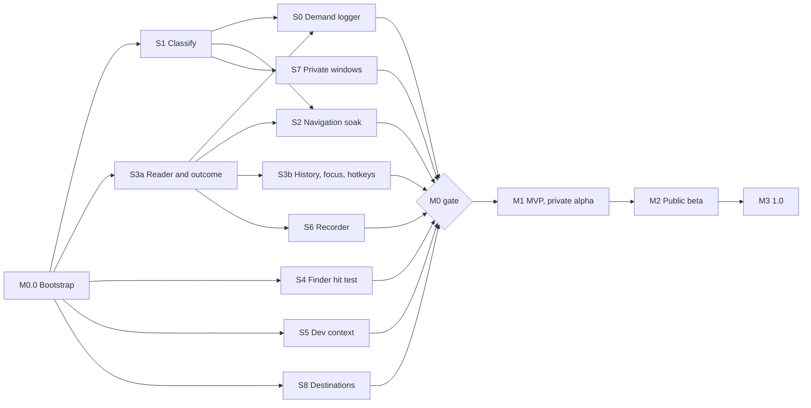

# Jilpa Implementation Plan

2026-09-20 · Anand Hegde · companion to [PRD.md](PRD.md) and [ARCHITECTURE.md](ARCHITECTURE.md)

> This plan sequences the PRD's milestones into work a solo developer can pick up in order. The PRD commits to no dates, and neither does this. Sizes are pre-spike estimates in ideal engineering weeks, good to about ±50%, and M0 replaces them with a real schedule. Milestone exit criteria are the PRD's and always outrank the sizes here.

The order is risk-first. M0 answers whether the problem is real and whether safe navigation is possible. M1 starts with a walking skeleton through the riskiest path and widens from there. Nothing P1 starts before M1 exits, and P2 stays locked until 1.0 ships.

## Sequencing principles

- **Kill risks in order of cost.** Demand, then navigation safety, then outcome detection, then everything else.
- **Walking skeleton first.** One dialog, one app, one hardcoded favorite, detected, navigated and verified end to end, before any breadth.
- **Contracts before features.** The SafetyGuard, the privacy gate and the session state machine exist before anything that would need them.
- **Evidence gates, not dates.** A work package is done when its acceptance rows pass, with counts where the PRD asks for counts.
- **Spike code is thrown away; spike foundations are not.** `JilpaAX`, the fixture app, the soak runner and the release pipeline start in M0 and are kept.

## Roadmap at a glance

| Milestone | Size, ideal weeks | Critical path |
| --- | --- | --- |
| M0 Spikes | 11 to 13, plus one calendar week of Spike 0 collection running in the background | Bootstrap → S1 and S3a → S2 |
| M1 MVP | 21 to 23, including two weeks of daily use | Dialog pipeline → Navigator → Panel → Predictor |
| M2 Public beta | 22 to 26 | Recorder, rules, Quick Search, automation surface, beta operations |
| M3 1.0 | 6 to 8 | Licensing, qualification of the advertised matrix |

The work-package sizes below sum to about 66 ideal weeks, so roughly 14 to 17 months of solo work before launch. If M0 shows that is too long, the first cuts are N5 breadth, D6 hover highlighting and the Settings search polish, not safety work.

## M0: bootstrap and spikes

The PRD numbers the spikes 0 to 8, but Spike 0 cannot run until Jilpa can detect a dialog, read its folder and tell confirm from cancel. So the build order differs from the numbering: bootstrap, then S1 and the reader half of S3, then ship the S0 logger and let it collect while the other spikes proceed.

### M0.0 Bootstrap (1 week)

| Task | Output |
| --- | --- |
| Repository layout from the architecture doc: `Package.swift`, empty targets, thin app target | `swift build` and `swift test` pass on an empty tree |
| `JilpaAX` foundation: `AXElement`, observer thread, per-pid `AXSession` with the 250 ms timeout, batched attribute reads | Kept. Every spike uses it |
| `FixtureApp` v0: Save and Open as window and as sheet | Kept. Grows into `JilpaDemo.app` and the test fixture |
| Release pipeline: Developer ID signing, hardened runtime, `notarytool`, stapling, a script that produces a notarized zip | Needed immediately for the Spike 0 volunteer build |
| CI: hosted runner for unit tests, import lint for the layering rules | Green pipeline |
| `CLAUDE.md` with build and test commands, the layering rules and the seven contracts as non-negotiables | Coding agents start from the constraints |
| Spike write-up template at `docs/spikes/TEMPLATE.md`: question, method, environment, results table, decision, architecture impact, raw data location | One format for nine results |

### Spikes

Each spike is a throwaway executable under `Tools/spikes/` and a written result under `docs/spikes/`. Spike tools run from a terminal that has been granted Accessibility, except Spike 0, which ships as a signed agent.

| Order | Spike | Builds on | Question to answer | Deliverable and decision | Size |
| --- | --- | --- | --- | --- | --- |
| 1 | **S1** Detect and classify | Bootstrap | Is there a stable signature for file dialogs across the 30-app set, including remote-service panels? How reliable is purpose detection? What does one observer per app cost at idle? | Signature table, purpose confusion matrix, false-positive count on non-file windows, idle footprint, proposed supported subset. **Go/no-go for core navigation** | 1 |
| 2 | **S3a** Reader and outcome | Bootstrap | Which source gives a real URL for the current folder in list, column and icon views? Can confirm be told from cancel without a keyboard tap, and how often is the answer unknown? | Ranked folder sources per view mode. Outcome-evidence table with the unknown share per app, for mouse and keyboard confirms separately. **Go/no-go: learning and metrics depend on this** | 1 |
| 3 | **S0** Demand check | S1, S3a | Is the problem frequent and costly enough? | Signed, notarized logger agent. Counts only, never paths; comparisons local; participant reviews the summary before sending. Fix the decision rule in writing **before** distribution. Working thresholds: median participant at 15 or more dialogs a day and a changed folder in 40% or more of confirmed dialogs. Also yields the unassisted time baseline and the share of browser saves that show a dialog | 0.5 build, then 1 calendar week |
| 4 | **S2** Navigation soak | S1, S3a | Does Go to Folder meet the safety contract, at what success rate and latency, per app, variant and OS? Do posted keys reach remote-service panels? Does setting `AXValue` take effect? Is there an element-targeted way to confirm the Go to Folder UI? | Soak runner and safety oracle (kept). About 600 clean attempts per candidate cell on macOS 27, then 26. Per-strategy latency to replace the provisional 400 ms. Interruption, timeout, focus-steal and cancellation cases. Filename-field fallback tested separately; one violation kills it. **Go/no-go for the product** | 2 to 3 |
| 5 | **S3b** History, focus and hotkeys | S3a | Do Back, Forward and Return preserve the filename? Does the non-activating key handoff work on windows, sheets and remote-service panels, and does focus return intact? Which window level keeps the strip above a modal panel? Which default chords collide? | Pass or fail per variant, the window level to use, the final default hotkeys. **Go/no-go for D11 and D20** | 1 |
| 6 | **S4** Finder hit testing | Bootstrap | Do Apple Events expose tabs and bounds well enough? Is `CGWindowList` z-order sufficient without Screen Recording? Does the tap pass other clicks through untouched? What happens on denial and revocation? | Chosen z-order source, tab model, tap behavior across two displays and overlapping windows | 1 |
| 7 | **S5** Dev context | Bootstrap | Which VS Code and Terminal signals give the project root reliably? Does the narrow ambiguity definition in the architecture doc behave well with multi-root workspaces and several windows? | Ranked signals, staleness behavior, freshness window, decision on whether a companion extension is needed. **Gates the N5 launch promise** | 1 |
| 8 | **S7** Private windows and attribution | S1 | Can private status be read from window-level indicators per browser? Which attribution source, if any, is available before the dialog opens? | Per-browser detection table including unknown, comparison of AX front tab, Apple Events and a downloads-API extension. **Gates recording and metrics in each browser**, so it runs in M0 proper, not at the end | 1 |
| 9 | **S6** Save recorder | S3a | What can be verified across cancellation, overwrite, pre-existing files, extension changes, delayed writes, packages and multi-file exports? What is the bounded observation window? | Published verifiable set, window length, outcomes that stay unverified. Gates N6 only | 1 |
| 10 | **S8** Destinations | Bootstrap | Do bookmarks and resource identifiers follow renames and moves? Which availability and File Provider states are readable? | State table with explicit unknowns; confirmation that no path silently substitutes. Gates N9 and N17 claims | 0.5 |

### M0 exit

- Spike 0 decision rule met, or scope rethought in the PRD.
- S1, S2, S3a and S3b are go. If S3a reports a high unknown-outcome share, the PRD decides whether the learning metrics stand before M1 begins.
- `docs/COMPATIBILITY.md` v0: named cells labelled supported, provisional, degraded or unsupported, with observed counts.
- Every **(H)** in the architecture doc is resolved to confirmed, replaced or removed.
- The PRD gaps listed in the architecture doc have decisions.
- This plan's sizes are replaced with a schedule (0.5 week).

## M1: MVP, private alpha

All P0. Work packages are listed in build order. Each ends with its acceptance rows from the PRD passing against FixtureApp and the M0 supported subset.

### WP1 Foundations (2 weeks)

Requirements: N14, privacy gate, the pure half of every contract.

- `JilpaCore` model types, `Resolved<T>`, location identity.
- `PrivacyGate` with `Cleared<T>` and `SensePermit`, the full decision matrix as table-driven tests, and the privacy property tests.
- `JilpaStore`: schema and migrations from the architecture doc, write APIs that accept only cleared records, retention job, erase, JSON export.
- `JilpaConfig`: TOML model, strict validation, merge with shadowing, directory watcher, atomic writer for `managed.toml`, last-valid retention.
- Logging with privacy-redacting formatters, `OSSignposter` categories, diagnostics bundle skeleton.
- **Done when:** N14 acceptance passes; a parse error keeps the last valid config and raises one notice; privacy property tests pass.

### WP2 Walking skeleton (1.5 weeks)

The thinnest vertical slice, against TextEdit and FixtureApp only.

- Watcher and stage-one classifier from the S1 signatures.
- Reader using the top-ranked S3a folder source.
- `DialogCoordinator` with the session state machine and user-activity latch.
- Go to Folder strategy with the SafetyGuard and arrival verification from S2.
- A bare panel with one hardcoded button that navigates.
- **Done when:** a Save sheet in TextEdit is detected, the button navigates, arrival and filename preservation verify, and typing mid-navigation aborts cleanly.

### WP3 Dialog pipeline to breadth (2 weeks)

Requirements: D1, D18.

- Stage-two structural classifier, purpose detection, capabilities, support levels.
- `JilpaCompat`: schema, Ed25519 verification, strict decoding, atomic apply, last-known-good, rollback, bundled bundle. Network refresh and its off switch land in WP9.
- Exclusions and per-app pause: observer teardown, persistence across relaunch.
- Outcome detection from the S3a evidence table, including the single-folder confirm-evidence watcher.
- Launch sweep for already-open dialogs as manual-only sessions. Circuit breaker.
- **Done when:** D1 and D18 acceptance passes across the M0 supported subset with zero panels on non-file windows.

### WP4 Navigator hardening and soak (3 weeks)

Requirements: D3, D20, the navigation safety contract.

- Full step model, expected-event sets, recovery matrix, per-OS compiled variants.
- No-substitution target resolution: missing, unmounted, online-only.
- History stack including observed native navigations; Back, Forward and Return.
- `nav_attempt` recording through the gate; correction detection.
- Soak runner to production quality: per-app drivers, safety oracle, Clopper–Pearson accounting, per-cell report. Fault injection through FixtureApp switches.
- VM images for macOS 26 and 27 with Accessibility granted in the snapshot; self-hosted runner.
- **Done when:** D20 acceptance passes; every candidate M1 cell has a soak report; zero safety violations.

### WP5 Panel host and input (3 weeks)

Requirements: D2, D11, the input and focus contract.

- Pre-created non-activating panel, window level from S3b, docking and fallback sides, sheet docking, multi-display and mixed-scale geometry, full screen and Stage Manager.
- Move and resize tracking: live, with fade-on-move built as the fallback. S3b found no lag from the host's move to ours (p95 4 ms, programmatic moves, a lower bound); the operator's hand-drag row decides whether the fallback is switched on. For a sheet, subscribe on the window it hangs from.
- Strip UI with the wireframe's zones, responsive collapse, notice line state machine, Liquid Glass with Reduce Transparency, Increase Contrast and Reduce Motion fallbacks, VoiceOver labels and announcements.
- `HotkeyCenter` with frontmost-scoped dialog registration.
- Fuzzy jump: key handoff, fuzzy matcher over favorites, recents, windows and suggestions, path, `~` and `file://` parsing, focus-restoration check.
- Attach-latency signposts and the CI performance assertion.
- **Done when:** D2 and D11 acceptance passes on windows, sheets, full screen, Stage Manager and a second display; attach is under 150 ms at p95.

### WP6 Favorites, recents, defaults and menu (2 weeks)

Requirements: D4, D5 (dialog recents), D8, S1.

- Favorites add from the dialog and by drag and drop, optional hotkeys in the dialog scope, immediate propagation to panel, fuzzy jump and menu.
- Recents from confirmed outcomes through decayed counters, global and per-app, pinning, ignored folders.
- Explicit defaults by app and purpose plus the purpose-neutral default, wired through `resolve`. Automatic navigation on open under the safety contract with the reason and Return.
- Menu bar: favorites, recents, Finder windows where permitted, pause, private mode; click navigates the active dialog or opens Finder.
- **Done when:** D4, D5, D8 and S1 acceptance passes, including nothing recorded for excluded apps, private mode and non-recording dialogs.

### WP7 Finder bridge (1.5 weeks)

Requirements: D6, D7.

- Apple Events window query, permission check without prompting, request on first use.
- Dialog-scoped mouse tap, hit testing against the S4 z-order source, click swallow for Finder windows only, pass-through otherwise, tab menu on right-click, hover overlay.
- Tap watchdog: re-enable after timeout-disable, teardown on loss of Accessibility trust.
- Open-windows list and cycle hotkey.
- **Done when:** D6 and D7 acceptance passes, and with Finder automation denied the feature is off and the panel says why.

### WP8 Predictor, contexts and developer awareness (2.5 weeks)

Requirements: N1, N4 pinning, N5.

- Candidate generation, signals with provenance, back-off scoring, in-memory aggregates with write-through, cold-start floor.
- Shadow ranking frozen at recognition and scored at confirmed outcomes with the eligibility rule.
- Consent gate math, holdout and suspension as pure code with the Wilson test vectors. The opt-in UI and predicted automatic navigation wait for M2.
- Contexts from config, pin with expiry from menu and hotkey, one re-armed timer, pin shown in the strip.
- VS Code and Terminal readers from S5, the active-project resolution with `unknown`, project root and existing common subfolders as candidates, git-root recognition in recents.
- Offline replay tool that re-ranks the local shadow log for weight tuning.
- **Done when:** N1, N4 and N5 acceptance passes; ranking is under 50 ms with no network; the VS Code → browser → Save flow demonstrates on the author's Mac.

### WP9 Settings, onboarding and alpha release (3 weeks)

Requirements: S10, S11, diagnostics, distribution.

- Settings with five panes driven by the `SettingDescriptor` registry and its search index.
- Onboarding with the live demo against `JilpaDemo.app`, Accessibility request, deferred Finder automation request, hotkey-clash prompt.
- `HealthCenter`: one notice per state change, fix paths, per-app support view.
- Redacted diagnostics bundle with local review. "Report this app" with a redacted AX snapshot the user reviews.
- Sparkle 2, signed compatibility-data refresh with independent off switches, Privacy pane disclosure of endpoints.
- Login item, first alpha build.
- **Done when:** S10 and S11 acceptance passes; an alpha installs, updates and rolls back compatibility data on a clean Mac.

### M1 exit

Two weeks of daily use on the author's Mac. Then the PRD's criteria: 99.5% navigation success on the supported matrix with per-cell counts and no safety violations, the editor → browser → Save flow demonstrated, and the app useful with Finder automation denied.

## M2: public beta

All P1. Packages are largely independent after WP10, so order within the milestone can follow beta feedback.

| WP | Scope | Requirements | Gate | Size |
| --- | --- | --- | --- | --- |
| WP10 Save recorder and history | Identity correlation, lifecycle states, overwrite, delayed write, package and multi-file handling, history timeline with reveal and copy path, 90-day retention | N6 | S6 | 3 |
| WP11 Quick Search | Global window on the shared chord, scopes, pasted paths, Spotlight fallback, in-memory index at 30 ms over 50,000 items | S2, S3, S4 | — | 2.5 |
| WP12 Rules with preview | Rule editor, template expansion, the shared `resolve` trace as preview, merged order display, one-click rule or exclusion from a suggestion, evidence-based reasons | N3, N2 | — | 3 |
| WP13 Predicted navigation | Per-app opt-in, invitation on gate pass, holdout, suspension with reasons, local stats with cold-start and trigger separation | N1 automation, N16 | 30+ eligible outcomes per cell | 2 |
| WP14 Dialog depth | Boomerang across view modes, hierarchical drill-in menus with type-to-filter, destination utilities, read-only info panel with Quick Look and no implicit downloads | D9, D10, D12, D13 | S3a selection read | 3 |
| WP15 Destinations | Availability states, File Provider locations, identity recovery with "Locate replacement…", repair lists | N9, N17 | S8 | 2 |
| WP16 Automation surface | `AutomationService`, socket with peer uid check, `jilpa` CLI, App Intents, `jilpa://` with confirmation UI, private-mode read denial | N12 | — | 2.5 |
| WP17 Context switching and clipboard | Optional active-project context switching, opt-in clipboard path suggestion and hotkey | N4 P1, N8 | S5 | 1.5 |
| WP18 Finder extras | "Add to Jilpa Favorites" service, closed-window tracking and reopen | S6, S7 | S4 | 1 |
| WP19 Import and config docs | Default Folder X importer with preview, documented hand editing, system recents behind Full Disk Access | N15, N14 P1, D5 P1 | — | 1.5 |
| WP20 Beta operations | Consented cohort telemetry with the allowlisted schema, opt-in crash reporting with redaction, public compatibility-data repository and signing workflow, developer-beta check within a week | Metrics, NFRs | Privacy review | 2 |

**M2 exit:** the PRD's criteria. Target 200 users in the consented cohort, the advertised matrix qualified to the D3 sample rule, hit rates measured against 60% and 85% with sample counts, correction rates reported, and recorder, privacy and destination-recovery cases passing.

## M3: 1.0 launch

| Track | Work | Size |
| --- | --- | --- |
| Licensing | Merchant of record integration, signed offline licence files, 30-day Pro trial, `Entitlements` enforcement at Pro entry points, post-trial behavior that keeps data and export, published branch support window | 2.5 |
| Qualification | Full soak of every advertised cell on macOS 26 and 27, accessibility audit with VoiceOver and full keyboard access, performance run, privacy review of every network call | 2 |
| Distribution | Website, documentation, published compatibility matrix, Homebrew cask, trademark and domain check | 2 |
| Polish | Beta feedback, string externalization check, final default hotkeys and feature names | 1 |

**M3 exit:** the PRD's evidence gates. Navigation 99.5%, crash-free 99.8% and activation 80% in the beta cohort, hit-rate targets met with sample counts and the Spike 0 baseline, no open safety or privacy violations, matrix and licence lifecycle documented.

**M4** follows the PRD: P2 features are chosen by demonstrated demand, and each passes its own feasibility, privacy and recovery gates.

## Cross-cutting tracks

These run through every milestone and are part of each work package's definition of done.

| Track | Standing rule |
| --- | --- |
| Compatibility matrix | `docs/COMPATIBILITY.md` is regenerated from soak reports. No cell is advertised without counts. A new macOS developer beta gets a matrix run within one week |
| Safety review | Any change under `JilpaNavigator`, `HotkeyCenter` or the fuzzy jump handoff reruns the fault-injection suite and the soak on at least the fixture cells |
| Privacy review | Every new sensor, stored field, network call or automation read adds a row to the gate matrix tests and a line to the Privacy pane disclosure before merge |
| Performance | Signpost assertions for attach, rank, search and idle footprint run in CI on the self-hosted Mac |
| Accessibility | VoiceOver labels and a keyboard path are part of done for every UI element, not a launch-time audit |
| Dependencies | Adding a fourth third-party dependency needs a written reason in the architecture decisions table |

**Definition of done for a work package:** PRD acceptance rows pass; unit tests cover the pure logic; the gate matrix is updated if data flows changed; signposts exist for any budgeted path; user-visible strings are externalized; the health view explains any new degraded state.

## Requirement traceability, P0

| ID | Modules | Spike gate | Work package |
| --- | --- | --- | --- |
| D1 Detection | JilpaDialog, JilpaCompat | S1 | WP2, WP3 |
| D2 Panel | JilpaUI PanelHost | S3b | WP5 |
| D3 Go to folder | JilpaNavigator | S2 | WP2, WP4 |
| D4 Favorites | JilpaConfig, JilpaUI | — | WP6 |
| D5 Dialog recents | JilpaStore, Core Predictor counters | S3a | WP6 |
| D6 Window Hop | JilpaSensors FinderBridge | S4 | WP7 |
| D7 Open windows | JilpaSensors FinderBridge | S4 | WP7 |
| D8 Defaults | Core Rules, JilpaNavigator | S1 purpose | WP6 |
| D11 Fuzzy jump | JilpaUI, HotkeyCenter, Core Search | S3b | WP5 |
| D18 Exclusions and pause | JilpaDialog, JilpaCompat, PrivacyGate | S1 | WP3 |
| D20 History | JilpaNavigator | S3b | WP4 |
| S1 Menu | JilpaUI | — | WP6 |
| S10 Settings | JilpaUI | — | WP9 |
| S11 Onboarding | JilpaUI, HealthCenter, JilpaDemo | — | WP9 |
| N1 Smart destination | Core Predictor, Consent | S3a | WP8, WP13 |
| N4 Pinning | Core Context, JilpaConfig | — | WP8 |
| N5 Developer awareness | JilpaSensors DevContext, Core Context | S5 | WP8 |
| N14 TOML storage | JilpaConfig | — | WP1 |

P1 traceability is the Requirements column of the M2 table.

## Risks to this plan

| Risk | Signal | Response |
| --- | --- | --- |
| Outcome detection leaves too many dialogs unknown | S3a unknown share is high for keyboard confirms | Decide in the PRD before M1: accept biased metrics with the share reported, or narrow the learning claim. Do not add a keyboard tap |
| Go to Folder cannot be confirmed safely on some variant | S2 finds no element-targeted confirm and the guarded Return shows any violation | That variant is unsupported. The product ships on the variants that pass |
| Posted keys do not reach remote-service panels | S2 on sandboxed apps | Sandboxed apps drop to provisional or unsupported, which changes the launch story. Surface it at the M0 gate |
| Soak automation costs more than navigation itself | WP4 overruns | It is the moat. Cut UI polish before cutting the harness |
| Live tracking of the panel looks bad | S3b drag tests (programmatic: no lag found) and the S3b hand-drag operator row | Ship fade-on-move |
| VS Code signals prove unreliable | S5 | Fall back to manual pinning as the MVP story and hold a companion extension for 1.x |
| The 14 to 17 month total is too long | M0 schedule | Cut breadth in this order: D6 hover highlight, N5 Terminal half, Settings search polish, D10. Never safety, recovery or the gate |

## First two weeks

1. Create the package layout, empty targets, CI and the import lint.
2. Write `CLAUDE.md` and the spike template.
3. Build `JilpaAX`: element wrapper, observer thread, per-pid session with timeout, batched reads.
4. Build FixtureApp v0 with Save and Open as window and sheet.
5. Stand up signing and notarization, and ship a notarized empty agent to prove the pipeline.
6. Start S1 against the first ten apps of the 30-app set.
7. Start S3a: folder sources in three view modes, then the outcome-evidence table.
8. Write the Spike 0 decision rule down and commit it before building the logger.
