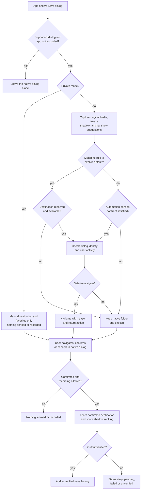
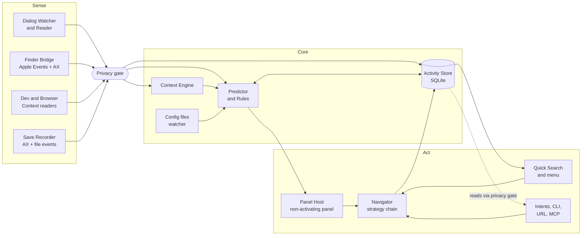

# Jilpa PRD

2026-09-20 · Anand Hegde

> This file is the canonical PRD. It started from rev 19 of the living doc at https://claude.ai/code/artifact/a381c226-1322-445d-a67b-1e39211e86ae, which is now a historical snapshot and is not kept in sync. History lives in git, with a summary in the changelog at the end.

Jilpa is a macOS utility that gets Open, Save and Export dialogs to the right folder in one action. Its first release focuses on reliable navigation, reversible suggestions and active-project awareness: know the project, reach the destination, and make a wrong guess instantly reversible. Default Folder X 6 is the navigation benchmark, not a feature-parity launch checklist. The name is Kannada slang for a cheeky trick or slick bypass, which is the product promise: skip the folder clicking.

## Problem and opportunity

The macOS Open and Save dialog often opens in the wrong folder, and getting to the right one takes several seconds of clicking. A knowledge worker hits file dialogs in every app, so the cost compounds. How often and how many seconds are hypotheses until Spike 0 measures them. The working assumptions are dozens of dialogs a day, a wrong starting folder most of the time, and 5 to 15 seconds lost on each.

The system dialog has three gaps:

- **No memory that matters.** It remembers the last folder per app, not the folder you need for this file or this project.
- **No link to what is already open.** The folder you want is usually visible in a Finder window, a terminal or an editor, but the dialog cannot see it.
- **No way back.** A wrong starting folder costs a manual trek, and once a file lands somewhere unexpected the dialog keeps no record of where it went.

Default Folder X has solved the first two for 25 years and remains the only serious product in the category. It also adds file management inside the dialog, which Jilpa deliberately leaves until after 1.0. It is a one-developer app at $39.95 with a settings-heavy interface and a design that predates on-device language models, App Intents and agentic coding tools.

The opportunity is a modern take: the same core tricks, a keyboard-first interface, and a prediction layer that puts the right folder one keystroke away without any setup.

**Demand assumptions to validate**

- The frequency and time-cost figures above are unmeasured.
- Browsers save downloads to `~/Downloads` without a dialog by default. A browser Save dialog appears only for commands such as Save As and Save Image As, or when the user has turned on "ask where to save each file". The browser-centric jobs below reach only those cases, and background filing of Downloads is a non-goal.
- Spike 0 tests both before the build starts.

## Users and jobs to be done

Jilpa targets Mac power users who save and open files in many apps across many projects. Developers are the beachhead segment, because no current product serves their folder context.

| Persona | Typical day | What they hire Jilpa for |
| --- | --- | --- |
| Developer | 5+ repos, terminal, editor, browser downloads, design exports | Save into the repo they are working in without browsing to it |
| Designer or video editor | Figma, Adobe and Final Cut exports into deep client folder trees | Reach `Client/Project/Exports/v3` in one keystroke, rename and tag on save |
| Consultant, lawyer, accountant | Dozens of PDFs a day from mail and browser into client and matter folders | File by client without thinking, find where a file went last week |
| Researcher or student | Papers, datasets and notes across cloud drives | Consistent filing across iCloud, Dropbox and Google Drive |

Jobs to be done, in priority order:

1. When a Save or Export dialog opens, put the folder for the project I am working on one action away.
2. When the guess is wrong, let me reach any recent, favorite or currently open folder in one action.
3. When I open a file, take me back to where I was and reselect what I last used.
4. When I saved something and lost it, show me where it went.
5. When a destination is wrong or unavailable, let me recover without losing my filename or place.

When Jilpa may change the folder by itself is a policy question, answered once in the automation consent contract.

## Goals, non-goals and success metrics

Version 1.0 succeeds if its first suggestion matches the confirmed destination at least 60% of the time after two weeks, measured where automatic navigation did not influence the outcome. Routine jumps among favorites, recents, suggestions and available project folders should take under 3 seconds. Reliability and reversibility gate release before breadth.

**Goals**

- Deliver the core navigation workflow: compact panel, favorites, recents, Finder window hopping, purpose-specific defaults and navigation history.
- Differentiate through prediction, keyboard speed, onboarding and a small, validated set of developer integrations.
- Support standard macOS file dialogs in the published, tested compatibility matrix, including selected sandboxed and Electron apps. Unknown variants remain usable without Jilpa.
- Keep all data on the Mac by default, with no account and no telemetry unless the user opts in.

**Non-goals for 1.0**

- Replacing Finder or being a general file manager.
- Enhancing custom, non-native file pickers such as those in some Java, Qt or in-browser web apps.
- Background auto-filing of Downloads, which is Hazel's territory.
- Windows, Linux or iOS versions.
- macOS 14, macOS 15 and Intel Macs. Default Folder X serves them well.
- Feature-for-feature parity with Default Folder X, including broad file management, arbitrary post-save scripts and every legacy setting.
- Support for every editor or terminal at launch; expand only after compatibility spikes establish reliable behavior.

**Success metrics**

| Metric | Target | How measured |
| --- | --- | --- |
| Top-1 hit rate | 60% or more after 2 weeks of use | Shadow ranking frozen when the dialog is recognized; first suggestion equals the confirmed destination. Headline counts only dialogs with no automatic navigation. Local stats, consented cohort aggregate |
| Top-3 hit rate | 85% or more | Same population and method |
| Automatic-navigation correction rate | Report by app, dialog purpose and trigger (rule, default, prediction). Feeds the suspension rule in the automation consent contract | Share of automatic navigations followed by Return to original folder or navigation elsewhere before confirmation |
| Routine jump time | Under 3 s median from hotkey to verified arrival | Local signposts over favorites, recents, suggestions and project folders |
| Median time from dialog open to confirm | Under 4 s provisional; final target set against the Spike 0 unassisted baseline | Separate Open, Save and Export |
| Panel attach latency | Under 150 ms at p95 from the AX window-created or sheet-created notification to panel visible | Signposts in debug builds |
| Navigation command success rate | 99.5% or more in aggregate, every advertised cell meeting the D3 sample rule, and zero observed safety-contract violations in release qualification | Verified arrival at the requested folder without unintended filename, extension, selection or focus changes |
| Crash-free sessions | 99.8% or more | Consented beta cohort; opt-in crash reports in production |
| Idle CPU and memory | Under 0.5% CPU, under 80 MB | Instruments in CI performance run |
| Onboarding activation | 80% or more of first launches grant Accessibility and complete a successful jump | Consented beta cohort funnel plus 5 to 10 observed first-run sessions. Finder automation uptake measured separately, not required for activation |
| Day-30 retention among activated users | 60% or more | Consented beta cohort only; licence check-ins are not behavioral telemetry |

Production telemetry is opt-in, so a first launch happens before anyone has been asked. Activation, retention and crash-free denominators therefore come from the beta cohort, where aggregate content-free metrics are a disclosed condition of joining. Opt-in production numbers are reported as a biased sample, never as the gate.

Report eligible sample counts, cold-start results before 20 confirmed outcomes, and results after two weeks separately. Cancelled dialogs and retracted confirmations are not training data. Failed navigation still counts against reliability. Record explicit suggestion selection separately from passive acceptance; an unchanged automatically selected folder is not evidence of independent prediction accuracy. Showing suggestions nudges users toward them, so hit rate measures product usefulness, not pure predictive accuracy. Time-saved estimates use the Spike 0 baselines and are labelled estimates when no comparable baseline exists.

## Baseline: what Default Folder X ships today

[Default Folder X](https://www.stclairsoft.com/DefaultFolderX/) 6.3 (September 13, 2026) is the reference product: $39.95 single licence, 30-day trial, macOS 10.13 through 27, sold outside the Mac App Store. [Version 6.3](https://www.stclairsoft.com/DefaultFolderX/release.html) added macOS 27 Golden Gate support and pinned recent items.

| Area | What it does | Jilpa launch scope |
| --- | --- | --- |
| Dialog toolbar | Buttons beside every Open and Save dialog for favorites, recent folders, recent files, open Finder windows and volumes, with hierarchical menus that expand on hover | Match |
| Finder-click | Click any Finder window behind the dialog to jump to its folder. Right-click picks a tab. Also works with Path Finder and Bloom | Match for Finder, later for others |
| Default folders | A default folder per app, plus remembering the last folder used | Extend by dialog purpose; explicit rules in 1.0 |
| Rebound | Reselects the last file or folder you used in that dialog | 1.0 where validated |
| Quick Search | Command+Shift+Space window that searches remembered files, folders, apps and Finder windows. Works inside dialogs and system-wide. Accepts pasted paths | Inline fuzzy jump with path entry in MVP; global navigation-focused search in 1.0; apps later |
| Info panels | Panels below the dialog to preview, get info, tag, comment and change permissions. Save dialogs get tags, comments and post-save actions | Read-only preview and info in 1.0; metadata editing later |
| File operations | Rename, duplicate, trash, zip, unzip, new folder, reveal, copy path, open in Terminal, all inside the dialog | New folder, reveal, copy path and open in terminal; broader management later |
| Filename helpers | Wider filename field. Click a grayed-out file in a Save dialog to copy its name | Defer; preserve native filename behavior at launch |
| Save actions | Run an action, AppleScript, Automator workflow or Shortcut on the file after saving | Manual reveal and copy path for verified output; automatic actions later |
| Menu bar menu | Customizable menu of favorites, recents, recent apps, recent and recently closed Finder windows. Drop files on the icon to move or copy via the menu | Favorites, recents and Finder windows at launch; drop-to-menu and app launching later |
| Finder drawer and Drag Zone | A shelf under Finder windows and beside dialogs for holding files | Defer to 1.x |
| Cloud awareness | Shows File Provider drives (Dropbox, OneDrive, Google Drive, Box) as top-level locations. Tracks shared cloud documents | Match locations in 1.0 |
| Shortcuts and scripting | Configurable hotkeys for everything, AppleScript dictionary, Shortcuts app support, Alfred and LaunchBar integration | Replace with App Intents, CLI and URL scheme |
| Settings sync | Syncs settings across Macs through iCloud | 1.x |
| Folder sets | Switchable groups of favorites | Named contexts and temporary project pinning |
| Exclusions | Per-app exclusion list, ignored folders for recents | Match |

Two lessons from its release notes shape this PRD. Most maintenance effort goes to per-app and per-macOS-version workarounds, so compatibility is the real moat. The app relies on the Accessibility API, so apps with broken accessibility support need an exclusion list.

## Contracts

Each policy below is stated once. Requirements, flows, risks and decisions refer to these by name instead of restating them. The privacy gate is the seventh contract and is defined under Privacy, security and legal.

**Navigation safety contract**

- Navigation never presses the host app's final Open, Save or Export confirmation.
- Folder changes preserve the proposed filename, extension and unrelated user input. Folder-only choosers do not expose filename actions.
- Capture the original folder when the dialog is recognized. Every automatic navigation offers Return to original folder; this undoes navigation, not a completed save.
- Before each automated step, verify the same dialog identity, owning app and expected focus. If the user types, navigates, changes selection or changes focus, stop and do not resume automatically in that dialog. Jilpa's own fuzzy jump taking key status under the input and focus contract is the one expected focus change.
- On timeout or partial failure, stop sending input. Restore temporary input only if ownership and state can still be verified and restoration cannot overwrite user changes. Otherwise leave native controls available and show a non-activating recovery notice; never send compensating keystrokes blindly.
- Typing a path into the filename field is disabled unless a dedicated spike proves it preserves the filename and extension through success, cancellation, timeout and user interruption.
- Release qualification must observe no unintended confirmations, filename corruption or input delivered to another window. Any such violation blocks release even if aggregate navigation success meets target.

**Input and focus contract**

- Jilpa never activates its own app while a dialog is open. The panel is non-activating.
- Dialog-scoped hotkeys (fuzzy jump, suggestion picks, Back, Forward, Return to original folder) are registered as system hotkeys only while a supported dialog is open and unregistered when it closes. There is no keyboard event tap and no keystroke recording, so no Input Monitoring permission.
- The fuzzy jump field takes key-window status without activating Jilpa. This is the only focus change Jilpa initiates. On dismissal or navigation, key status returns to the dialog and its previously focused element, normally the filename field, with contents and selection intact. If that cannot be verified, stop and show the recovery notice.
- Default shortcuts must not collide with system or common-app defaults. Command+Shift+Space is taken by 1Password Quick Access and by Default Folder X. Control+1 to 3 switch Mission Control desktops. Control+Option+Space switches input sources. Working defaults are Control+Option+J for fuzzy jump and Quick Search, and Control+Option+1 to 3 for suggestion picks. Spike 3 runs a conflict survey before these are final, and onboarding asks when it detects a clash.

**Automation consent contract**

- Suggestions are the default. Jilpa changes the folder by itself only for an explicit default, an enabled rule, or a prediction that satisfies this contract. All three obey the navigation safety contract and show a reason plus Return to original folder.
- Predicted automatic navigation needs both explicit per-app opt-in and the confidence gate for that app and dialog purpose. Passing the gate may prompt an invitation. It never grants consent.
- **Shadow scoring.** In every dialog the predictor's ranking is frozen when the dialog is recognized and later compared with the confirmed destination. An eligible outcome has a confirmed destination, recording allowed and no automatic navigation in that dialog. Dialogs where a rule, default or prediction navigated are scored and reported separately and never count toward the gate.
- **Confidence gate.** The 95% lower confidence bound (Wilson) on shadow top-1 accuracy is at least 70% over the most recent 50 eligible outcomes, with a minimum of 30. For reference, that is 26 of 30 or 42 of 50. The numbers are provisional and tuned in beta. Missing evidence means suggestions only.
- **Holdout.** While predicted navigation is on for an app and purpose, about one dialog in ten stays suggestion-only so the gate keeps receiving eligible outcomes.
- **Suspension.** Predicted navigation suspends itself for an app and purpose when the gate fails on current evidence, or when more than 20% of the last 20 automatic navigations were corrected. Suspension reverts to suggestions and says why. Consent is kept, and navigation resumes only after the gate passes again, with a notice.
- The evidence for every app and purpose is visible in local stats (N16), and automation can be turned off per app at any time.

**Rule and context resolution**

1. User activity within the dialog wins over all automation.
2. An explicit project pin determines the active context until released or expired; automatic signals cannot override it.
3. Rules are evaluated in the user's visible order. Template variables count as match conditions: a rule whose template needs `{context}` does not match while no context is active, and evaluation continues. The first enabled matching rule wins.
4. Without a matching rule, use an explicit app-and-purpose default, then a purpose-neutral app default. Remembered last-used folders are suggestion candidates, not explicit defaults. Unknown purpose never selects a purpose-specific default.
5. Without a rule or explicit default, a prediction may navigate only under the automation consent contract; otherwise keep the native folder and show suggestions.

If the winning rule or default resolves to an unavailable, deleted or missing destination, evaluation stops there under the no-substitution policy. Rule preview lists competing matches, rules skipped for missing variables, the expanded path and the reason lower rules lost. Previews include manual context pins and never navigate or create folders.

**No-substitution policy**

- Jilpa never silently replaces a destination that the user, a rule or a default named with a different one.
- An unavailable, deleted or unknown destination leaves the native folder unchanged and shows the reason.
- No automatic mounting of volumes and no implicit download of online-only content.
- Creating a missing folder requires an explicit action after previewing its full path.
- Repairs list every affected favorite, default and rule before they apply.

**Save outcome lifecycle**

- **Destination selected:** a candidate path, not proof of anything.
- **Confirmed:** the user pressed the native confirmation and the dialog closed by confirming, not cancelling. The folder at that moment is the confirmed destination. It is evidence of intent and applies to Open, Save, Export and folder choosers. It trains the predictor and scores the hit-rate metrics. A confirmation is retracted if the host re-presents the dialog or reports failure within the observation window.
- **Save pending:** after confirmation, correlate actual output with that dialog. Merely closing a dialog or finding a pre-existing file at the path is not sufficient.
- **Verified:** correlate the final path and file identity with evidence of the host write, including overwritten files and extension changes. This status means observed local output, not cloud synchronization or a guarantee against later application writes. Only verified output enters confirmed save history and feeds reveal, copy path and any future post-save action.
- **Cancelled / failed / unverified:** record only the status supported by evidence. If completion or the actual output cannot be established within a bounded observation window, label it unverified rather than guessing failure or success. Cancelled dialogs train nothing. Determine the observation window in the recorder spike.
- Track overwrite prompts, delayed writes, package documents and multi-file exports explicitly. Record the output set only when it can be attributed; unsupported output shapes stay unverified.
- Future automatic post-save actions additionally require validated completion semantics for that workflow. Private mode, excluded apps and non-recording dialogs persist none of these events. Open events describe observed dialog selection, not proof that the host successfully read the file.

## Requirements: Open and Save dialogs

The dialog panel is the product. This section targets standard macOS file dialogs in the tested compatibility matrix. P0 ships in the MVP, P1 in 1.0, P2 after 1.0. Tier is the working Free or Pro split from the pricing section.

| ID | Feature | Requirement | Priority | Tier |
| --- | --- | --- | --- | --- |
| D1 | Dialog detection | Detect supported standard Open, Save, Export and folder-selection dialogs, as window or sheet, and classify purpose and capabilities. Unknown purpose is reported as unknown and triggers no purpose-specific automation | P0 | Free |
| D2 | Jilpa panel | A compact panel docked to the dialog edge that follows it on move and resize and hides when the dialog closes. Side is configurable and falls back when off screen. Focus behavior follows the input and focus contract | P0 | Free |
| D3 | Go to folder | Any Jilpa navigation action switches the active dialog to a given folder under the navigation safety contract, without visible flicker where avoidable | P0 | Free |
| D4 | Favorites | User-pinned folders and files with optional hotkeys, added from the dialog or by drag and drop. Finder service and CLI entry points arrive with S6 and N12 | P0 | Free |
| D5 | Recent folders and files | Tracked globally and per app from confirmed dialog activity, ranked by frecency, with pinning. System recent-items lists are an optional later source that needs Full Disk Access | P0 dialog recents, P1 system recents | Free |
| D6 | Window Hop | Hovering a Finder window behind the dialog highlights it, clicking jumps to its folder. Right-click lists tabs. Must not block other floating windows | P0 | Free |
| D7 | Open windows list | Menu of open Finder windows and tabs with a hotkey to cycle them | P0 | Free |
| D8 | Default folder per app and purpose | Separate explicit defaults for Open, Save, Export and folder-selection dialogs, plus a purpose-neutral app default. Precedence follows rule and context resolution | P0 | Free |
| D9 | Boomerang | Reselect the last file or folder used in this app and folder, in list, column and icon views | P1 | Free |
| D10 | Hierarchical menus | Hover any folder to drill into subfolders, with type-to-filter. Option toggles sort by name or date | P1 | Free |
| D11 | Inline fuzzy jump | One hotkey inside the dialog opens a fuzzy finder over favorites, recents, open windows and suggestions, and accepts a typed or pasted path, `~` path or `file://` URL. Enter navigates. Key handling follows the input and focus contract | P0 | Free |
| D12 | Destination utilities | New folder by explicit request, reveal in Finder, copy path and open in terminal. Actions that do not apply to the current chooser or destination are disabled | P1 | Free |
| D13 | Read-only info panel | Quick Look preview, size, dates and path with click to copy. Online-only content is never downloaded for a preview without consent | P1 | Free |
| D14 | Filename helpers | Widen the filename field, copy an existing filename, and offer date and counter templates, each after compatibility validation | P2 | Free |
| D15 | Post-save actions | Reveal, copy path, open, share, or run a Shortcut or script on verified output. Manual reveal and copy path ship earlier in N6 | P2 | Pro |
| D16 | Permissions editor | Change POSIX permissions and lock state from the info panel | P2 | Free |
| D17 | Drag Zone shelf | Temporary shelf beside the dialog for drag and drop | P2 | Free |
| D18 | Exclusions and per-app pause | Per-app disable and pause from the panel or menu, plus a shipped exclusion list for apps with broken accessibility support, updatable through signed compatibility data | P0 | Free |
| D19 | Gestures | Three-finger swipe up to go to the parent folder | P2 | Free |
| D20 | Dialog navigation history | Back, Forward and Return to original folder within the current dialog, preserving the proposed filename and extension and restoring selection where supported. History ends with the dialog | P0 | Free |
| D21 | File and metadata editing | Rename, duplicate, move to Trash with confirm, compress, expand, and edit Finder tags or Spotlight comments. Collision and recovery behavior is specified before implementation | P2 | Free |

Acceptance for D3 is the gate for the whole product: 99.5% success in aggregate across the supported compatibility matrix, reported per app, OS and dialog variant. A cell is advertised as supported only when the 95% upper confidence bound on its failure rate is at or below 0.5%, which takes about 600 consecutive clean attempts and more after any failure. Cells short of that are labelled provisional and show observed counts. Fallback between strategies is allowed only when it preserves the navigation safety contract.

**P0 acceptance**

| ID | Accepted when |
| --- | --- |
| D1 | Every file dialog in the supported matrix is detected and classified inside the panel latency budget. No non-file window gets a panel across the Spike 1 app set. Unknown purpose is reported as unknown |
| D2 | The panel tracks move and resize without detaching, never activates Jilpa, and disappears with the dialog. Holds for windows, sheets, full screen, Stage Manager and a second display |
| D3 | The acceptance paragraph above |
| D4 | One action in the dialog adds a favorite, and it appears at once in the panel, fuzzy jump and menu. A favorite's hotkey navigates the active dialog |
| D5 | After a confirmed dialog its folder appears in global and per-app recents in frecency order. Pinned entries persist. Excluded apps, private mode and non-recording dialogs add nothing |
| D6 | Clicking a visible Finder window navigates to its folder without activating Finder, and right-click lists its tabs. Clicks on other windows pass through untouched. With Finder automation denied the feature is off and the panel says why |
| D7 | The list matches Finder's open windows and tabs when the dialog opens, and the cycle hotkey visits each |
| D8 | An explicit default for app and purpose navigates on dialog open under the safety contract and offers Return to original folder. Unknown purpose uses only the purpose-neutral default |
| D11 | The hotkey opens the field, Enter navigates, and Escape returns key status to the dialog with the filename field intact. A typed or pasted path resolves without touching the filename field |
| D18 | Pausing an app removes its panel, sensing and recording at once and survives relaunch. Apps on the exclusion list never get a panel |
| D20 | After any sequence of navigations, Back, Forward and Return restore the right folder with filename and extension unchanged. History is discarded when the dialog closes |

## Requirements: Finder, menu bar and Quick Search

Outside dialogs, Jilpa is a menu bar app, joined in 1.0 by one global search window. The same data powers both, so a folder learned in a dialog is reachable everywhere.

| ID | Feature | Requirement | Priority | Tier |
| --- | --- | --- | --- | --- |
| S1 | Menu bar menu | Favorites, recent folders and files, and open Finder windows. Click opens in Finder, or navigates the current supported dialog if one is active. Pause and private mode live here. Hierarchical drill-in and recently closed windows arrive with D10 and S7 | P0 | Free |
| S2 | Quick Search | Global hotkey window, sharing the fuzzy jump hotkey outside dialogs. Fuzzy search over everything Jilpa remembers. Enter opens, right arrow searches inside a folder, Command+1 to 9 picks a row | P1 | Free |
| S3 | Paste a path | Pasting or typing a path, `~` path or `file://` URL in Quick Search goes straight there | P1 | Free |
| S4 | Search scopes | Prefix filters for folders, files and Finder windows, plus an explicit Spotlight fallback. Results pass through the privacy gate. App search is deferred with S8 | P1 | Free |
| S5 | Drop to menu | Drop files on the menu bar icon and pick a move, copy or alias destination. Collision and recovery behavior is specified with D21 | P2 | Free |
| S6 | Finder services | "Add to Jilpa Favorites" in the Finder contextual menu. Move, Copy or Alias services are deferred with broader file management | P1 | Free |
| S7 | Reopen closed Finder windows | Track closed Finder windows and tabs and reopen them from the menu or Quick Search | P1 | Free |
| S8 | Recent apps | Track recently used apps so Quick Search can double as a light launcher | P2 | Free |
| S9 | Finder drawer | Shelf under Finder windows that follows items when renamed or moved | P2 | Free |
| S10 | Settings | One window, five panes: General, Folders, Rules, Shortcuts, Privacy. Every option searchable. No hidden Option-click settings | P0 | Free |
| S11 | Onboarding and permission recovery | Explain sensing and control with a live demo, request Accessibility, then offer Finder automation when a Finder feature is first used. Health checks explain degraded features, revoked permissions and recovery without repeated prompts | P0 | Free |
| S12 | Settings sync | Sync favorites, rules and shortcuts through iCloud. Missing folders on another Mac show dimmed | P2 | Free |

**P0 acceptance**

| ID | Accepted when |
| --- | --- |
| S1 | The menu lists favorites, dialog recents and, where permitted, Finder windows. A click opens in Finder or navigates the active supported dialog. Pause and private mode are reachable without opening Settings |
| S10 | Every option is findable through settings search, and no behavior depends on a hidden modifier |
| S11 | With Accessibility alone, a new user completes a jump in the live demo. Revoking a permission produces one health notice with a fix path, not repeated prompts |

## Requirements: new for 2026

The launch differentiators are reversible destination suggestions and a validated active-project workflow. Rules, pinned contexts and verified save history deepen that workflow in 1.0. Broader integrations and automation follow reliability, not a parity checklist.

| ID | Feature | Requirement | Priority | Tier |
| --- | --- | --- | --- | --- |
| N1 | Smart destination | Rank likely folders from app, dialog purpose, file type, proposed filename, active context or project, front Finder window and frecency, each signal carrying provenance. Top 3 have pick shortcuts. Automatic navigation only under the automation consent contract | P0 | Pro |
| N2 | Explainable suggestions | Each suggestion shows an evidence-based reason, and one click creates a rule or excludes the destination. An inferred source domain is labelled inferred | P1 | Pro |
| N3 | Rules with preview | Match app, dialog purpose, file type, filename pattern and context, resolving to a folder or template such as `~/Clients/{context}/Invoices/{yyyy}`. Preview shows a sample match, the expanded destination and the winning rule before enabling. Source-domain conditions are P2 and depend on spike 7 | P1; P2 source-domain conditions | Pro |
| N4 | Contexts and project pinning | Named workspaces swap favorites and defaults, and rules when N3 ships. Pin a project until changed, for a duration, or until Jilpa quits, with the pin and expiry visible. Manual contexts and pinning ship in MVP, optional active-project switching in 1.0 | P0 pinning, P1 automatic switching | Pro |
| N5 | Developer awareness | MVP proves one editor → browser → Save workflow with VS Code and Terminal: offer the active project root and common subfolders, recognize git roots in recents, and show unsupported or unknown context as such. Further editors and terminals ship only after per-integration validation, not title-based guesses | P0 validated pair, P2 broader integrations | Pro |
| N6 | Verified save and open history | Searchable timeline of observed Open events and Save or Export outcomes: name, folder, app, time, lifecycle status and source attribution where available. Reveal and copy path work on verified output. Retention defaults to 90 days | P1 | Pro |
| N7 | Oops move | Optional affordance to move verified output to another folder, offered only in workflows validated not to break the host app's document relationship. Collision, cross-volume and later-write behavior is specified before implementation | P2 | Pro |
| N8 | Clipboard and selection awareness | Opt-in. If the clipboard holds a path or a copied Finder item, offer its folder as a suggestion. One hotkey goes to the clipboard path | P1 | Free |
| N9 | Destination availability and cloud state | Show detected File Provider locations as top-level destinations and mark each destination available, unavailable, deleted or unknown. Provider sync state appears only where spike 8 shows it is reliable. The no-substitution policy applies | P1 | Free |
| N10 | Smart naming | Suggest a filename from the proposed name, the source page title and the naming pattern already used in the destination folder, such as `2026-09-20_acme_invoice.pdf`. Uses Apple's on-device Foundation Models where available, templates otherwise. Opt-in | P2 | Pro |
| N11 | Natural language recall | Quick Search understands queries like "pdf I saved from Chrome last Tuesday" by translating them on-device into a save history filter | P2 | Pro |
| N12 | Automation surface | App Intents for Shortcuts and Spotlight actions, a `jilpa` CLI (`jilpa go`, `jilpa fav add .`, `jilpa recent --json`, `jilpa context use`) and a `jilpa://` URL scheme. All go through the Navigator and the privacy gate, and URLs follow the URL scheme rule under Security. Raycast and Alfred extensions follow later | P1 for Intents, CLI and URL scheme; P2 for extensions | Pro |
| N13 | Agent bridge | Optional local MCP server so coding agents can ask where a file belongs and read favorites and the active context. Read-only, off by default, approval per client | P2 | Pro |
| N14 | Config as code | Favorites, rules and contexts live in TOML under `~/.config/jilpa/` from the first alpha. `config.toml` is hand-owned and never rewritten by Jilpa; `managed.toml` holds UI edits. Both use one validated model with atomic writes, and the last valid configuration is retained on parse errors. Config cannot import or enable executable actions | P0 storage format, P1 documented hand editing | Free |
| N15 | Import from Default Folder X | Read the user's existing favorites, default folders and exclusions on first launch, with preview. Per-app defaults import as purpose-neutral defaults | P1 | Free |
| N16 | Local stats | Show top-1 and top-3 hit rate, correction rate, navigation reliability, sample counts and baseline-backed time-saved estimates. Cold-start is separated from learned performance, and rules and defaults from predictions | P1 | Free |
| N17 | Destination recovery | Follow folder identity across renames or moves where supported, and offer "Locate replacement…" for favorites, defaults and rule destinations. The no-substitution policy applies | P1 | Free |
| N18 | Additional context triggers | Opt-in Focus, schedule and Wi-Fi context switching. Wi-Fi requires Location permission. These triggers never override a manual project pin | P2 | Pro |

**P0 acceptance**

| ID | Accepted when |
| --- | --- |
| N1 | Suggestions appear inside the ranking budget with no network. A cold start shows fewer suggestions rather than fabricated ones. The shadow ranking is frozen and stored locally for every eligible dialog |
| N4 | A pin set from the menu or a hotkey shows in the panel with its expiry, ends on time, and outranks any sensed context while active |
| N5 | With one project open in VS Code, a browser Save dialog offers the project root as a suggestion. With several candidate projects or stale context, the state reads unknown and no project suggestion is made |
| N14 | Favorites, pins and contexts persist in the two TOML files from the first alpha. A parse error keeps the last valid configuration and surfaces the error |

The prediction model in N1 starts with local frequency and recency, no language model and no network. It learns from confirmed destinations, so it does not depend on the save recorder. Measure usefulness after 20 confirmed outcomes rather than promising a universal cold-start threshold. Signals are optional and carry provenance; missing context must not become a fabricated guess. A learned ranker can replace it later behind the same interface.

Source attribution is best-effort. A front browser tab is a candidate, not proof of a download's origin. Where-from metadata exists only after the file is written, so it can corroborate history but can never drive navigation. An inferred front-tab domain may rank suggestions when labelled inferred; it never drives rules or automatic navigation. Source-domain rule conditions need an attribution source available before the dialog opens, and the realistic one is a browser extension using the downloads API, which exposes the URL and referrer. Spike 7 decides whether that extension is worth its distribution and maintenance cost. Until then the consultant persona is served by app, file type, filename pattern and context.

Config files merge in a fixed order. Entries from `config.toml` show in the UI as file-managed and read-only, with an action that opens the file. Rule order is `config.toml` rules in file order, then managed rules in UI order, and rule preview shows the merged order.

## Key flows and UX principles

The save flow is the one to get right: show a useful destination immediately, change folders only under the contracts, and let the user confirm the save through the native dialog.



Non-recording dialogs take the normal path but fail the recording check at the end, and predicted automatic navigation is off in them. Rules and explicit defaults precede predictions, and an unresolved destination stops evaluation under the no-substitution policy.

UX principles:

- **Keyboard first.** Every action has a keyboard path. Routine jumps use a hotkey, short query and confirmation; measure the under-3-second target rather than promising an arbitrary folder in three keystrokes. The mouse path stays complete for window-hopping users.
- **Quiet by default.** The panel is one slim strip, not a bezel around the dialog. Read-only info opens on demand. No toast after each save; future correction affordances are optional.
- **Never fight the user.** User input or navigation cancels automatic intervention, and automation follows the automation consent contract.
- **Explain every trick.** Automatic navigation shows a reason and Return to original folder. No wording implies that navigation undo reverses a completed save.
- **Native look.** Liquid Glass materials with full light and dark support, honoring Reduce Transparency.
- **Zero-config value.** With Accessibility alone, manual folder jumps and dialog recents work before a favorite is added. Finder window hopping becomes available when Finder automation is granted; other optional permissions do not block activation.

**Panel wireframe.** A working sketch to test in design, not a spec. It exists because "one slim strip" has to carry every P0 control.

```text
 host Save dialog
 ┌────────────────────────────────────────────────────────────────────
 │ Save As: [ report.pdf ]            native browser, untouched
 └────────────────────────────────────────────────────────────────────
 Jilpa strip, docked to one edge
 [‹] [›] [↩]  |  [1 jilpa/docs] [2 Exports/v3] [3 Invoices/2026]  |  [★] [◷] [▢]  |  [● jilpa · 2h]  [⋯]
```

| Zone | Holds | From |
| --- | --- | --- |
| History | Back, Forward, Return to original folder | D20 |
| Suggestions | Top 3 as chips with pick numbers, reason on hover or focus. Collapses to one chip plus a count, then to an icon, as the dialog narrows | N1, N2 |
| Menus | Favorites, recents, open Finder windows, with drill-in later | D4, D5, D7, D10 |
| Context | Active pin or context with its expiry; click to change or release | N4 |
| Overflow | Pause for this app, private mode, destination utilities, info panel, Settings | D18, D12, D13 |
| Notice line | One line that temporarily replaces the suggestions zone: the reason for an automatic navigation, an unavailable destination, a recovery notice. Never stacks and is never a toast | Contracts |

## Technical architecture and feasibility spikes

Jilpa is a non-sandboxed Swift menu bar agent that watches other apps through the Accessibility API and draws its own windows next to their file dialogs. It injects no code into other processes, which keeps it compatible with System Integrity Protection and the hardened runtime.



Sensors report through the privacy gate, which also tells them what not to read. The predictor feeds the panel and search, and every navigation goes through one Navigator. Navigation outcomes, confirmed destinations and verified save outcomes are distinct records. CLI, URL scheme and future MCP access obey the same gate as the UI.

**Stack**

- Swift 6 with strict concurrency. AppKit for the panel, menus and event handling. SwiftUI for Settings, Quick Search and onboarding.
- SQLite through GRDB for the activity store. Two TOML config files for favorites, rules and contexts.
- Developer ID signed, notarized, hardened runtime. Sparkle 2 for updates. Apple silicon only for 1.0; an Intel slice waits for a tested Intel matrix.
- Predictor, Rules and Context Engine are pure Swift packages with no UI or AX dependency, so they are fully unit testable.

**Components**

| Component | Approach | Main unknown |
| --- | --- | --- |
| Dialog Watcher | One AXObserver per running app, subscribed to window created, sheet created, focus changed and element destroyed. Classify file dialogs by AX identifier, subrole and structure | Stable signature across sandboxed apps, where the panel is drawn by a system service |
| Panel Host | Non-activating floating NSPanel positioned from the dialog's AX frame, repositioned on AX moved and resized events | Smooth tracking during live resize, sheets, full screen and Stage Manager; key-window handoff for fuzzy jump |
| Navigator | Ordered, compiled strategies per supported OS. Primary: trigger Go to Folder, set its path through AX, confirm only that sheet, then verify arrival and preserved input. Filename-field fallback remains disabled until its safety spike passes | Safe cancellation and recovery after timeout, partial input, focus changes and user interruption |
| Dialog reader | Read purpose, current folder, selection and proposed filename through AX; expose unknown purpose or capabilities rather than assuming them | Real URLs versus display names; distinguishing Save from Export, file from folder choosers, and confirm from cancel |
| Finder Bridge | Finder window list, tab targets and bounds through Apple Events, z-order through AX, click capture through an event tap active only while a dialog is open | Tabs, multiple displays, windows on other Spaces |
| Save recorder | Correlate native confirmation, candidate path, final file identity and bounded filesystem observations. Expose the lifecycle states; existence alone cannot verify a save | Extension changes, overwrites, delayed writes, packages, multi-file output and reliable completion evidence |
| Dev context | Spike VS Code project detection and Terminal working-directory detection first, using supported or validated local signals. Manual project pins are independent of sensing and always win | Project root versus active document directory; multiple workspaces; distinguishing unsupported from stale context |
| Context Engine | Named contexts and explicit project pins with expiry first; optional validated active-project switching next. Focus, schedule and Wi-Fi adapters are deferred | Deterministic precedence, pin expiry and optional permission handling |
| Automation | App Intents in the main app. CLI and future MCP are thin local clients. All navigation uses the safety contract and all reads use the privacy gate | Client authorization, untrusted URL callers, excluded-data filtering and behavior during private mode |

**Permissions**

| Permission | Needed for | Required |
| --- | --- | --- |
| Accessibility | Detecting and driving dialogs, reading editor and terminal context, the Window Hop click tap | Yes |
| Automation: Finder | Finder window hopping and open-window lists; later metadata editing | Optional; required only for those features |
| Automation: browsers | Tab attribution, only if spike 7 selects Apple Events for it | Optional; not requested at launch |
| Full Disk Access | System recent-items lists (the P1 part of D5) or operations requiring protected-folder access, where confirmed necessary by spikes | Optional; permission denial does not disable basic dialog navigation |
| Location | Deferred Wi-Fi context switching only | Optional; not requested at launch |

**Spikes to run before committing to the plan**, each one a throwaway command-line tool with a written result:

0. Demand check. Run a passive dialog logger on the author's Mac and 5 to 10 volunteer Macs for a week. It keeps counts only, never paths: dialogs per day by app and purpose, whether the confirmed folder differed from the starting folder, seconds from open to confirm, and how often a browser save showed a dialog at all. Comparisons happen locally and each participant reviews the summary before sending it. The output validates the problem statement, supplies the unassisted baseline the metrics need, and doubles as the Dialog Watcher prototype. Set the decision rule before collecting data; working thresholds are a median participant with at least 15 dialogs a day and a changed folder in at least 40% of confirmed dialogs.
1. Detect and classify dialogs in an exploratory 30-app set spanning AppKit, sandboxed, Electron, Catalyst, Adobe and Microsoft Office; include Java as a negative/custom-picker case. Output signatures, purpose-detection reliability and a proposed supported subset.
2. Run navigation attempts on macOS 27 first, then 26, on Apple silicon, sized to the D3 sample rule of about 600 clean attempts per candidate cell. Report success and latency per app, variant and strategy, and use the measured latency to replace the provisional 400 ms target. Exercise filename/extension preservation, cancellation, focus changes, timeout and interruption. Test filename-field fallback separately; one safety violation blocks that strategy.
3. Read current folder, selection and filename in file and folder choosers across list, column and icon views. Prove Back, Forward and Return to original folder without losing current filename input. Prove the input and focus contract: dialog-scoped hotkey registration, the fuzzy jump key-window handoff on windows, sheets and out-of-process panels, and telling confirm from cancel. Survey default hotkey conflicts.
4. Validate Finder window hit testing with tabs, two displays, overlapping windows and denied/revoked Finder automation.
5. Prove VS Code → browser → Save project continuity and Terminal working-directory detection, including manual pinning, expiry, multiple projects and unknown context. Cursor, Zed, Xcode, JetBrains, iTerm2, Ghostty and Warp remain expansion candidates, not launch commitments.
6. Validate the save recorder on cancellation, overwrite prompts, pre-existing files, extension changes, delayed writes, packages and multi-file exports. Publish what can be verified, the bounded observation window, and which outcomes remain unverified.
7. Validate private-window detection browser by browser from window-level indicators only, including unknown private state. Compare three attribution sources: the front tab through AX, Apple Events, and a browser extension using the downloads API. Include a download whose source differs from the front tab, and demonstrate conservative suppression of sensing and recording.
8. Validate folder identity recovery, missing and disconnected volumes, denied access, and cloud-provider availability/state signals. Record unknown states explicitly and verify the no-substitution policy holds.

Spike 0 decides whether the problem is big enough to build for. Spikes 1 to 3 are go/no-go for core navigation. Spike 5 gates the developer launch promise, which needs editor-side context only and so does not wait on spike 7. Spike 6 gates verified save history and anything that acts on output; it no longer gates learning. Spike 7 gates browser tab sensing, source attribution, source-domain rules, and recording or learning from each browser's dialogs. Spike 8 gates cloud-state claims. Complete these before committing to the release matrix and schedule. The reference product is evidence of category feasibility, not proof that any proposed implementation or API approach works.

## Privacy, security and legal

Jilpa holds Accessibility permission and potentially sensitive dialog activity, so trust is a launch requirement. Activity content stays on the Mac. Operational networking for updates, compatibility data and licensing is documented separately from optional telemetry; it never uploads paths, filenames, browser sources or history.

**Privacy**

- All history, predictions and naming suggestions are computed and stored locally. Language features use Apple's on-device models only.
- No account. Production telemetry is opt-in and contains aggregate counts only. Beta builds make the same aggregate, content-free metrics a disclosed condition of joining. Crash reporting is separately opt-in and must redact activity content, paths, filenames, URLs and document/window titles before upload; diagnostics are locally reviewable.
- **Privacy gate.** One component decides, before sensing, learning, persistence and any automation read, whether an event may be sensed, stored or exposed. Private mode, exclusions and non-recording dialogs are its inputs. UI, CLI, URL scheme and MCP all go through it.
- Private mode, available by menu and hotkey, disables automatic browser, clipboard and developer-context sensing, history recording, model learning, automatic destination changes and history-derived suggestions. Discard pending observations when enabled. Explicit manual navigation and favorites remain usable without recording.
- While private mode is active, CLI and future MCP history, recent-activity and inferred-context reads are denied; they may expose only explicitly configured favorites and manually pinned context, subject to exclusions.
- **Non-recording dialogs.** Dialogs of private browser windows, and of browser windows whose private status is unknown, are non-recording: Jilpa does not inspect the tab, attribute a source, retain dialog activity or learn from the outcome. Private status is read from window-level indicators only. Suggestions that carry no browsing information still appear: favorites, explicit defaults, rules, and the pinned or sensed active project. Predicted automatic navigation is off in these dialogs. Until spike 7 validates private-window detection for a browser, all of that browser's dialogs are non-recording.
- Exclusions apply before sensing and persistence where identity is known, and before learning, suggestions, history display and automation reads. Enabling an exclusion suppresses matching existing records and derived suggestions. Source-domain exclusion requires attributable context; unknown attribution is not permission to collect browser activity when a domain exclusion could apply. Offer deletion of matching stored activity.
- Store domain only by default, with attribution status; full URL storage requires a separate opt-in and never overrides private mode or exclusions. Clipboard awareness is also explicitly opt-in and disabled in private sessions.
- History retention defaults to 90 days, with one-click erase covering stored activity and learned state, plus an explicit local JSON export. Operational licences and telemetry consent are independent of history.

**Operational networking**

- Disclose update and compatibility-check endpoints, request metadata and frequency in Privacy settings; provide independent controls to disable both checks. The app remains usable offline with its installed compatibility data.
- Licensing contacts the merchant/licensing service for purchase or activation and clearly disclosed entitlement operations only. Do not use check-ins for retention analytics or transmit app usage. Define offline activation recovery and avoid recurring online checks for an already activated perpetual entitlement.
- User-initiated website, support, download and diagnostics actions are distinct from background checks. Any future iCloud settings sync is separately opt-in. None of these exceptions permits uploading activity content as telemetry.

**Security**

- No code injection, no kernel or system extensions, no private entitlements.
- The mouse event tap runs only while a file dialog is open. Keyboard input follows the input and focus contract: system hotkey registration, no keyboard tap. Detect user intervention from focus and AX state changes without recording keystrokes or their contents. If a strategy cannot reliably detect intervention, disable its automatic use rather than extending global input capture.
- The activity database is stored with user-only file permissions under Application Support.
- The CLI socket accepts connections from the same user only. The MCP server is read-only, off by default and asks for approval per client.
- **URL scheme rule.** Any web page or app can open a `jilpa://` URL, so URLs are untrusted input. A URL may open Quick Search prefilled or show a folder in Jilpa's own UI. Navigating an active dialog, changing a context or pin, or adding a favorite from a URL requires a confirmation in Jilpa's UI that shows the full path. URLs never create folders, run actions or return data to the caller.
- User scripts in save actions run only from a folder the user populated, never from synced settings.
- Updates are signed with EdDSA through Sparkle and served over HTTPS.
- Compatibility data is developed in a public repository. The maintainer reviews changes and signs the bundles, and the signing key never lives in that repository. Bundles are verified independently of transport, schema-versioned and applied atomically. Reject unknown fields or invalid versions, retain the last known-good bundle, and allow explicit rollback and disabling checks. Rejected updates never broaden the supported app set.
- Compatibility bundles may select bounded, compiled strategies and declarative signatures or exclusions only. They cannot introduce scripts, arbitrary input sequences or executable code, and cannot weaken any contract. Behavior requiring a new strategy ships as a signed application release.

**Legal and competitive positioning**

- Features and ideas are not protected, expression is. Jilpa is a clean-room build: no Default Folder X code, assets, icons, screenshots, manual text or interface copy.
- Use original names. "Finder-click" and "Rebound" are St. Clair Software's feature names, so Jilpa needs its own, in keeping with the brand. Working names: "Window Hop" and "Boomerang".
- Marketing may say "an alternative to Default Folder X" as a factual comparison, without its logo or any suggestion of affiliation.
- The importer in N15 reads the user's own settings file on their Mac, at their request.
- Check "Jilpa" for trademark conflicts in software classes before buying a domain.

## Non-functional requirements

Jilpa runs all day inside other apps' most fragile moment, so it must be invisible when idle and must never make a dialog worse than stock.

| Area | Requirement |
| --- | --- |
| Performance | Panel visible within 150 ms at p95 of the AX window-created or sheet-created notification. Suggestions ranked within 50 ms. Quick Search results within 30 ms per keystroke over 50,000 remembered items. Navigation within a provisional 400 ms at p95 for local destinations, replaced by per-strategy targets from spike 2; network and File Provider destinations are reported separately |
| Footprint | Under 0.5% CPU idle, under 80 MB memory, no polling loops. Observers only |
| Fail-safe | Unknown signatures do not trigger automation. AX calls have a 250 ms timeout and never run on the UI main thread. On timeout, stop input and use the navigation safety contract for partial-state recovery; do not claim an already-modified dialog was untouched |
| OS support | macOS 26 and 27 on Apple silicon for 1.0, validated on 27 first because developers move to the newest release early. macOS 14, 15 and Intel Macs are out of scope for 1.0. M0 publishes the supported matrix and expansion criteria. On-device language features require supported hardware and runtime availability |
| App compatibility | Publish named supported, provisional, degraded and unsupported app/dialog variants. Explore 30 apps in M0; qualify every advertised matrix cell each release. Forty apps is an expansion goal, not a substitute for per-cell evidence |
| Beta readiness | Run compatibility checks on available macOS developer betas within 1 week. Treat beta support as experimental until qualified. Signed, bounded signature changes may ship as data; new strategies require an app release |
| Accessibility | Full VoiceOver labels, full keyboard access, respects Reduce Motion, Reduce Transparency and Increase Contrast |
| Displays and windows | Correct on multiple displays, mixed scale factors, full screen apps, Stage Manager and Spaces |
| Localization | English at launch. All strings externalized. Kannada and Hindi are natural early additions given the brand |
| Testing | Unit tests for predictor, rule precedence, the confidence gate, config merging and save-state transitions. Fixture app for dialog variants, plus actual-app integration runs on supported OS versions. Soak every advertised cell to the D3 sample rule and report per-cell counts; inject cancellation, focus races, permission revocation and unavailable destinations |
| Diagnostics | Local redacted diagnostics bundle the user can review and send. Health checks show permissions, per-app support and recovery actions. Per-app pause is available from the panel/menu without opening Settings; unknown AX snapshots are never uploaded automatically |

## Release plan, distribution and pricing

No dates are committed. M0 determines whether the problem is worth building for, the supported platforms, integration viability and verification limits, and produces the first schedule. One developer's compatibility-maintenance capacity constrains scope; milestone exit criteria take precedence over dates.

| Milestone | Timing | Scope | Exit criteria |
| --- | --- | --- | --- |
| M0 Spikes | Before schedule commitment | Spike 0 demand check and eight feasibility spikes; initial OS/app matrix | Spike 0 decision rule met or scope rethought; written signatures and results; core navigation go/no-go; verified-outcome and privacy limitations; validated developer pair; scoped release estimate |
| M1 MVP, private alpha | After M0 gates pass | All P0: core navigation, favorites and dialog recents, window hop, purpose-specific defaults, Back/Forward/Return, inline fuzzy jump with path entry, menu bar menu, baseline predictor with shadow scoring, manual project pinning, validated VS Code/Terminal context, onboarding, exclusions and TOML storage. Learning uses confirmed destinations; recorder foundations may land without the P1 history UI | Daily use for 2 weeks; 99.5% navigation success on the supported matrix with no safety violations and per-cell counts reported; demonstrated editor → browser → Save flow; useful with Finder automation denied |
| M2 Public beta | After M1 | All P1: Quick Search with pasted paths and scopes, system recents, boomerang, drill-in, destination utilities/read-only info, Finder favorites service and closed-window recovery, explainable suggestions, rule previews, optional active-project context switching, verified history, opt-in clipboard paths, destination recovery/cloud state, Intents/CLI/URL scheme, documented config editing, importer and stats | Target 200 beta users in the consented cohort; advertised matrix qualified to the D3 sample rule; hit rates measured against the 60%/85% targets; correction rates reported; recorder, privacy and destination-recovery cases pass |
| M3 1.0 launch | Evidence-gated | Polish, licensing, website, docs and distribution | Navigation 99.5%, crash-free 99.8% and activation 80% in the beta cohort; hit-rate targets met with sample counts and the Spike 0 time baseline; no outstanding safety/privacy violations; supported matrix and licence lifecycle documented |
| M4 1.x | After launch | P2 selected by demand: wider editor/terminal support, source-domain rules if spike 7 allows, Focus/schedule/Wi-Fi triggers, file/metadata editing, drop-to-menu, filename helpers, validated post-save actions and Oops move, naming/recall, agent bridge, shelves, sync and launcher extensions | Each feature passes its own feasibility, privacy and recovery gates; no expansion solely for competitor parity |

**Distribution.** Direct download only, signed and notarized. The Mac App Store is not an option, because a sandboxed app cannot control other apps' dialogs through the Accessibility API. Add a Homebrew cask at launch, and apply to Setapp after 1.0 for a second revenue channel.

**Pricing recommendation.** A free tier with the classic tricks (favorites, recents, window hop, fuzzy jump and Quick Search) and a one-time Pro licence at $29 with a year of updates for prediction, rules, contexts, save history and automation. The Tier column in the requirement tables is the working split. Safety and recovery features are always Free. New users get 30 days of Pro. This undercuts the $39.95 reference price, lets the free tier spread by word of mouth, and avoids a subscription that this audience resents for a utility. The free tier also carries the compatibility support load without revenue, which is why free tier versus trial-only stays an open question. Sell through a merchant of record such as Paddle or Lemon Squeezy to offload sales tax.

**Licence lifecycle.** An activated Pro licence keeps its purchased features on the last eligible app version after the included year ends; expiry never disables navigation, hides the user's history or removes export access. New feature releases after that year require an optional paid upgrade. Security and compatibility-data fixes remain available without renewal for supported app branches; publish each branch's support window before sale. A fix requiring a newer binary or OS may require upgrading, so do not promise perpetual compatibility with future macOS releases. After the 30-day trial, retain configuration and data and allow history viewing/export; disable only new Pro processing and automation, without deleting records or moving files.

## Risks and mitigations

The biggest technical risk is not building Jilpa but keeping it working: every macOS release and many app updates can break dialog handling. The biggest product risk is that the problem is rarer or cheaper than assumed.

| Risk | Likelihood | Impact | Mitigation |
| --- | --- | --- | --- |
| The problem is rarer or less costly than assumed, or too few people will pay for a fix | Medium | Critical | Spike 0 with a decision rule set before data collection. Keep scope sized for one developer |
| The headline browser flow rarely fires because browsers download without a dialog | Medium to high | High | Spike 0 measures how often a browser save shows a dialog. Onboarding explains "ask where to save". Do not market a flow that rarely triggers |
| A macOS update changes the file dialog's accessibility tree or the Go to Folder behavior | High, yearly | High | Narrow supported matrix, beta checks, signed bounded signatures and compiled strategies. Stop unsafe automation; new behavior needs an app release |
| Apple restricts Accessibility control of file dialogs, as it has tightened other permissions | Low to medium | Critical | No mitigation beyond tracking betas. Keep Quick Search, history and the menu useful on their own |
| Long tail of apps with broken or custom dialogs | High | Medium | Exclusion and quirks data in a public repository, shipped as signed bundles. In-app "report this app" with a redacted AX snapshot the user reviews |
| Predictions that are wrong feel worse than none | Medium | High | The automation consent contract: suggestions by default, holdout and automatic suspension, instant original-folder recovery and one-click exclusion |
| Users refuse Accessibility permission or distrust a history log | Medium | High | Explain sensing, support optional-permission denial, put the privacy gate before persistence, expose network exceptions and keep explicit private mode |
| Apple ships better dialogs or a native recents feature | Medium | Medium | The prediction, rules and developer layers sit above anything Apple is likely to build |
| St. Clair Software responds on features or price | Medium | Low | Compete on prediction and developer context, not on parity |
| Solo-maintainer burnout on compatibility work | Medium | High | Two OS versions and one architecture at launch. Automate the matrix. Public compatibility data so contributors can help |
| Scope creep from the P2 list | High | Medium | P2 stays locked until 1.0 ships |

## Decisions and remaining questions

**Decisions**

- Automatic predicted navigation follows the automation consent contract: per-app opt-in plus a confidence gate that never grants consent, with holdout and automatic suspension.
- The predictor learns from and is scored against confirmed destinations. Verified output is reserved for save history and anything that acts on a file.
- Browser dialogs with unknown private status are non-recording but still show suggestions that carry no browsing information, so the developer flow does not wait on spike 7.
- Source-domain rule conditions are P2 and ship only if spike 7 finds an attribution source available before the dialog opens.
- Rule template variables are match conditions; only an unavailable destination stops evaluation.
- The MVP proves a small developer workflow, targeting VS Code and Terminal, with manual project pinning. Broader integrations are P2 and spike-gated.
- Back, Forward, original-folder recovery and purpose-specific defaults are P0. Global Quick Search, pasted paths outside dialogs and system recents are P1; the inline fuzzy jump keeps path entry in P0.
- Oops move, broader file/metadata management, arbitrary save scripts and Focus/schedule/Wi-Fi triggers are P2.
- 1.0 supports macOS 26 and 27 on Apple silicon, validated on 27 first. Supported app count and release dates are settled by M0 evidence, not parity targets.
- Jilpa is a closed-source commercial app. Compatibility data lives in a public repository and ships as maintainer-signed bundles.
- Configuration is stored as TOML from the first alpha, split into a hand-owned file and a UI-managed file.
- Activation, retention and crash-free rates are measured on a consented beta cohort. Operational networking is disclosed separately, and retention analytics never use licensing traffic.

**Remaining questions**

- [ ] What are the final Spike 0 decision thresholds? \[Set before collecting data; working values are in the spike\]
- [ ] Is the free tier worth the support load, or is a 30-day trial simpler? \[Free tier remains the pricing proposal; revisit after beta\]
- [ ] What is the published maintenance window per paid app branch, and the optional upgrade price? \[Resolve before taking payments; do not sell undefined lifetime compatibility\]
- [ ] Is a browser extension worth its distribution and maintenance cost for source attribution? \[Spike 7 decides\]
- [ ] What are the final default hotkeys? \[After the spike 3 conflict survey\]
- [ ] What gate threshold, window and holdout rate feel right in daily use? \[Provisional values in the automation consent contract; tune in beta\]
- [ ] Are "Window Hop" and "Boomerang" the right feature names, or should they lean into Kannada like the product name?
- [ ] Support Path Finder, ForkLift and other Finder replacements for window hop? \[After 1.0\]
- [ ] Which P2 feature has demonstrated demand after the navigation workflow is stable? \[The agent bridge stays P2; no launch-story exception\]
- [ ] Domain and trademark check for "Jilpa".

## Sources

Checked against the product and release pages on 2026-09-20: version 6.3 (September 13, 2026), $39.95, 30-day trial, macOS 10.13 through 27. Mac App Store status and the feature descriptions in the baseline table are inherited from the earlier snapshot and were not rechecked. The 6.3 notes mention a Focus filter; confirm what it does before presenting Focus-based context switching (N18) as new. Recheck primary sources before public comparisons or release-support claims.

- [Default Folder X product page](https://www.stclairsoft.com/DefaultFolderX/): features, version, price and system requirements
- [Default Folder X: What's new](https://www.stclairsoft.com/DefaultFolderX/release.html): 6.3 release notes
- [Default Folder X 6: A tour of what's new](https://www.stclairsoft.com/blog/default-folder-x-6-new-features/): Quick Search, drag to menu, save actions, iCloud sync, drawer
- [Default Folder X 6.0.5 announcement](https://www.stclairsoft.com/blog/2024/04/15/default-folder-x-6-0-5-better-handling-of-cloud-synced-folders-pasting-paths-into-quick-search-a-smarter-finder-drawer-alfred-5-support-and-more/): File Provider cloud folders, pasted paths, Alfred support
- [Default Folder X 4.x release notes](https://www.stclairsoft.com/DefaultFolderX/release_notes.html): history of per-app and per-OS workarounds
- [Apple: Accessing files from the macOS App Sandbox](https://developer.apple.com/documentation/security/accessing-files-from-the-macos-app-sandbox): sandbox and Full Disk Access constraints

The technical approach is my assessment from public macOS APIs, not from Default Folder X internals. The spikes in the architecture section exist to confirm it.

## Changelog

- **2026-09-20, review pass.**
  - Made this file canonical and put it under git.
  - Moved every cross-cutting policy into a Contracts section and cut the restatements. Added the input and focus contract, the automation consent contract (shadow scoring, Wilson-bound gate, holdout, suspension) and the no-substitution policy.
  - Switched learning and hit-rate scoring from verified output to confirmed destinations, which also covers Open dialogs and removes the P0 dependency on the save recorder.
  - Defined non-recording dialogs so unknown private status no longer disables the developer flow.
  - Moved source-domain rule conditions to P2 behind spike 7, and added a browser extension as an attribution candidate.
  - Made rule template variables match conditions.
  - Replaced flat attempt counts with a per-cell sample rule for the 99.5% claim, and made the 400 ms navigation target provisional.
  - Moved activation, retention and crash-free measurement to a consented beta cohort.
  - Added the URL scheme rule.
  - Added Spike 0 and two demand risks.
  - Moved global Quick Search, pasted paths outside dialogs and system recents to P1.
  - Committed to macOS 26 and 27 on Apple silicon.
  - Decided closed source with public compatibility data.
  - Stored config as two TOML files from the first alpha.
  - Added Tier columns, P0 acceptance tables and a panel wireframe.
  - Redrew both diagrams with the privacy gate and the save recorder.
  - Refreshed the Default Folder X baseline to 6.3.
